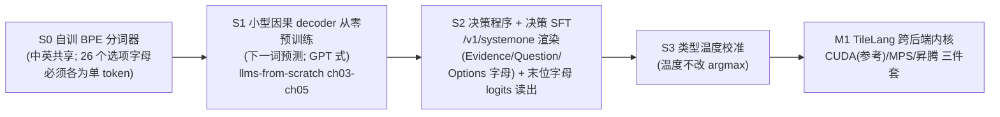

# deep-multimodal-laya (DML) — 课程大作业 · 第一部分：学习版（from-scratch）

> **主线一句话**：从零（禁载任何预训练权重）造一个与正式版**同骨架**的决策小模型——**因果 decoder + 选项字母读出 + 类型温度**——走通「分词器 → 下一词预训练 → 决策化 → 校准」全链路，并用 **TileLang** 内核让它跑在 **CUDA / MPS / 昇腾** 三种硬件上。
>
> **课程分两部分（同一仓库、同一架构）**：本文件 = **第一部分·学习版**（from-scratch、重过程）；[`PRODUCTION.md`](PRODUCTION.md) = **第二部分·正式版**（载预训练 backbone、SFT+OPD+RL、1M+多模态+中文，硬门槛：**0.8B 规模下同时优于 laya 与 StartLux-0.8B，Jev 为参考上限**）。**过渡方式**：正式版只是把"自训小脑"换成"预训练大脑"，`dmlaya/{decision,kernels,eval,data}` **原样复用**。教学主线参照 [llms-from-scratch-cn](../llms-from-scratch-cn)。

---

## 0. 主线与范围（先读这节，防跑偏）

### 0.1 唯一必做主线（M0 + M1）



### 0.2 三项扩展的归属（一阶段不做，只保证"不堵死"）

| 扩展 | 一阶段（学习版） | 二阶段（正式版） |
|---|---|---|
| **1M 上下文** | 不实做；decoder+RoPE 架构天然可扩（可选支线 M2） | RoPE 缩放 + 滑窗/稀疏/线性注意力落地 |
| **原生多模态 + 中文** | 中文仅体现为 S0 词表与 S1 语料含中文（几乎零成本）；不做视觉 | 载 ViT 联合训练 + 中文专项数据/评测 |
| **跨 MPS + 昇腾** | ✅ **M1 必做**（kernel 层从零阶段做最自然） | 生产化（FP8/服务/CI） |

> 归属逻辑：**跨硬件是"内核层"的事，归一阶段；1M/多模态/中文是"能力层"的事，载重后再做最省力**。一阶段结束即交付三项扩展之一。

### 0.3 一阶段明确不做（勿自加戏）

RL/RLCD（归二阶段 RL 栈）、laya 式 encoder+[MASK]marker 复现、MoE、mHC、FP8、视频、真跑 1M、任何第三方预训练权重。

### 0.4 laya 与本作业的关系

laya 是**非自回归 System-1 决策引擎**：state + 类型化问题（`choice`/`noul`/`score`）→ 单次前向 → 各选项**校准概率**。它是本作业**要击败的基线**，也是决策格式与温度校准的参考（`common.py`/`calibrate.py`）。**架构裁决**：laya 走"双向 encoder + marker 打分"；DML 全程统一为"**因果 decoder + 字母读出**"——与 StartLux-Decision、正式版同构，且滑窗/稀疏/线性注意力等长上下文手段可直接同向借鉴。

---

## 1. 学习目标

1. **from-scratch 全链路**：分词器 → 因果 decoder 下一词预训练 → 决策化 → 校准，每环亲手实现、不载现成权重。
2. **读出式判别建模**：一次前向、末位字母 logits → 选项分布 + 温度校准；理解它与生成式、与 laya marker 式的差别。
3. **TileLang 跨后端内核**：一套算子三方言（CUDA/MPS/昇腾）实现、数值对拍、运行时分发。
4. **过程性评测**：用与正式版同一 harness 报告学习信号（曲线/消融），为二阶段打基础。

---

## 2. 参考阅读（只列必要的）

| 参考 | 用途 |
|---|---|
| `llms-from-scratch-cn/` | **S0/S1 教学主线**：ch02 BPE、ch03 从零注意力、ch04 从零 GPT、ch05 预训练；可复写代码，**不可载权重** |
| `laya/` | 决策 schema、温度校准、`/v1/systemone` 服务、滑窗 kernel；**要击败的基线** |
| `StartLux-Decision/` | **同构路线参照**：`jevfmt.py` 渲染、`model.py` 字母读出、`finetune/calibrate.py` 温度；只读思路（权重 CC BY-NC，红线禁载） |
| `tilelang/` + `TileKernels/` | M1 的 DSL 与 `_kernel/_cuda/_asc` 三件套 + 设备抽象范式（扩展出 `_mps`） |
| `jev-cookbook/` | 三原语与校准概率的**中文认知教材**（ch1–3，可离线 mock 跑）与二阶段评测方法论（ch6 harness/ch10 数据四分）。⚠️ ch10 是**载 Laya 权重的微调**且属 encoder+marker 路线：一阶段**只读不行**（§7-0 红线），架构不借；该仓 CC BY-NC-SA，重写勿拷贝 |

### 2.1 逐环节参考地图（文件级；参考仓用 `bash refs/clone.sh` 一键拉到 `refs/`）

| 环节 | 去哪里看（按顺序） |
|---|---|
| S0 分词器 | `llms-from-scratch-cn/Codes/ch02/01_main-chapter-code/`（`ch02.ipynb` BPE、`dataloader.ipynb`）；**26 字母单 token 校验**照抄思路：`StartLux-Decision/startlux_decision/jevfmt.py` 的 `check_tokenizer()` |
| S1 decoder + 预训练 | `Codes/ch03/01_main-chapter-code/`（`ch03.ipynb`、`multihead-attention.ipynb`）→ `Codes/ch04/01_main-chapter-code/gpt.py`（GPT 骨架）→ `Codes/ch05/01_main-chapter-code/{gpt_train.py,gpt_generate.py}`（训练循环/采样验收；完整预训练脚本另见 `ch05/03_bonus_pretraining_on_gutenberg/pretraining_simple.py`）；进阶对照 `Model_Architecture_Discussions/llama3/llama3-from-scratch.ipynb` |
| S2 决策程序 + SFT | 渲染：`StartLux-Decision/startlux_decision/jevfmt.py`（`messages()`/`option_lines()`/`from_systemone()`）；读出：同目录 `model.py`（`letter_rows`、`_slot_logits`、`_wide` 分组票选、`decide/decide_batch`）；SFT 超参：`StartLux-Decision/finetune/finetune_lora.py`（CE 在读出位、r16/α32/lr1e-4/2ep）；数据 schema：`laya/laya/common.py` 的 `build_sequence/render_options` |
| S3 校准 | `StartLux-Decision/finetune/calibrate.py`（NLL 网格 [0.2,5]、ECE 10 bins、<200 样本池化、写入 decision_config）；clamp 思想：`laya/laya/common.py` 的 `clamp_temperature` |
| M1 TileLang 内核 | **现成 TileLang 写法**：`laya/laya/tl_kernels.py`（GEMM/LayerNorm+残差/RoPE/滑窗 attn + `T.Pipelined`；⚠️ 其 attn 为**双向**滑窗，改成**因果**）+ `laya/laya/fast.py`（CUDA graph 编排）；DSL 入门：`tilelang/examples/quickstart.py`、`examples/gemm/`、`examples/flash_attention/`；双范式：`TileKernels/tile_kernels/moe/topk_gate_{cuda,asc}.py` + `config.py` 设备抽象；昇腾：`tilelang/tilelang/ascend/README.md` |
| M2 长文支线 | `Naive-N0.5-Flash/config.json`（`sliding_window=128`、hybrid 层型）与 `modeling_naive_n05_flash.py` 的 SWA 掩码/sink bias；kernel 侧回 `tilelang/examples/flash_attention/` |
| M3 评测 | `StartLux-Decision/eval/`（`suites.py`、`typed_decisions.py`、`latency.py` 的协议与指标）；对拍范式：`TileKernels/tile_kernels/testing/` |

> 辨析：DML 输出"选项分布"而非生成文本；一阶段训练只有"下一词预训练 + 决策 SFT + 温度"，RL 归二阶段。**只读只改思路，不载任何参考项目权重**。

---

## 3. 项目目录结构（两轨统一，单一真源）

```txt
deep-multimodal-laya/
├── GUIDE.md  PRODUCTION.md        # 两部分手册
├── dmlaya/                        # ★ 共享实现（一阶段产出、二阶段原样复用）
│   ├── decision/                  # ★★ 两阶段同构的桥梁
│   │   ├── render.py              #   /v1/systemone → Evidence/Question/Options(字母) 渲染
│   │   ├── readout.py             #   末位 logits × 26 字母行 → 选项分布；>26 选项分组票选
│   │   └── temperature.py         #   类型温度（不改 argmax）
│   ├── model.py                   # 小型因果 decoder（GPT 式：因果注意力+RoPE+MLP）
│   ├── calibrate.py               # 温度拟合(NLL 网格)、ECE
│   ├── lang/                      # 中英 tokenizer 封装（26 字母单 token 校验）
│   ├── kernels/                   # ★ TileLang 算子三件套: gemm/layernorm/rope/attn_sw(因果滑窗)
│   ├── backends.py                # ★ 设备探测 + 分发(cuda/mps/npu) + 能力抽象
│   ├── data/  eval/  testing/     # 数据装配 / 标准评测 harness / torch_ref 对拍
├── learning/                      # ★ 一阶段专用（禁载权重）
│   ├── s0_tokenizer.py  s1_pretrain_gpt.py  s2_decision_sft.py  s3_calibrate.py
│   └── configs/
├── configs/ examples/ tests/ docs/
├── runs/                          # 实验 lab notebook（一阶段即养成习惯；二阶段成论文证据链）
└── pyproject.toml
```

> `production/`（载 backbone + SFT/OPD/RL + 1M/多模态/中文）与 `serving/` 见 [`PRODUCTION.md`](PRODUCTION.md) §4。

---

## 4. 里程碑、验收与工期

### M0 — 从零主线（必做，教学核心）
- **任务**：S0 自训 BPE（中英，**26 字母各为单 token**）→ S1 随机初始化小 GPT decoder 做下一词预训练（50M–150M；0.5B–5B token）→ S2 实现决策程序并在 typed-decisions 类数据上做 SFT（CE，soft target=分布）→ S3 类型温度校准。
- **交付**：`dmlaya/{decision,model,calibrate}.py` + `learning/s0–s3` + 训练曲线(loss/ECE)。
- **验收（过程）**：① tokenizer 可编解码中英且字母单 token；② 预训练 loss 稳降、能生成可读短句；③ SFT 后决策准确率**高于随机**；④ 校准后 ECE **较校准前改善**；⑤ 一键复跑。

### M1 — TileLang 跨后端内核（必做，重点）
- **任务**：GEMM、LayerNorm+残差、RoPE、**因果滑窗注意力**用 TileLang 重写为 `_kernel/_cuda/_mps/_asc`；`backends.py` 探测分发；`testing/torch_ref` 逐算子对拍。
- **验收**：CUDA+MPS 必过；昇腾代码完备（无环境则 CI skip）；bf16 与 CUDA 参考 `err ≤ 2e-2`、决策 argmax 一致；`M` 动态一次编译复用。
- **提示**：最省力路径是**改造 `laya/tl_kernels.py`**（同一套 GEMM/LayerNorm/RoPE 已验证，attn 改因果）再扩方言；Metal 用 `tilelang.metal.language`，昇腾用 `tilelang.ascend.language`（AIC/AIV、SIMD `S.*`）；同算法双范式参考 TileKernels `topk_gate_{cuda,asc}`；完整文件级地图见 §2.1。

### M2 — 长上下文课程（**可选支线**，加分）
- RoPE base 缩放 + 课程扩窗 + 因果滑窗；合成 needle 验证"召回随扩窗单调提升"；≥64K 达标、冲 256K。1M 与稀疏/线性注意力归二阶段。

### M3 — 收尾
- 用 `dmlaya/eval/` 出报告：学习曲线、SFT 前后、校准前后、三后端一致性；诚实边界清单。

### 工期与难度（一阶段）

| 环节 | 难度 | 人周 |
|---|---|---|
| S0 分词器（含字母约束） | ★★ | 0.5 |
| S1 decoder 从零预训练 | ★★★★ | 2–3（有 llms-from-scratch 路径可循） |
| S2 决策程序 + SFT | ★★★ | 1.5 |
| S3 校准 | ★ | 0.5 |
| M1 TileLang 三后端 | ★★★★ | 2–3 |
| M3 评测报告 | ★★ | 1 |
| M2 可选支线 | ★★★★ | +2 |

> 建议 **2–4 人/组、8–10 周**；与二阶段（8–12 周，含论文级技术报告与互审）合计仍在一学年内完成。范围比旧版收窄：RL/多模态/1M/中文专项均已移出。

---

## 5. 数据集（一阶段只需两类；含获取指引）

**S1 预训练语料（从零，中英混排 0.5B–5B token）**——HF/魔搭双源；✅ 镜像 id 已实测确认，魔搭下载用 `MsDataset.load('<id>')` 或 `modelscope download --dataset <id>`；`streaming` 取前 N GB 即可：
- 中文：`HuggingFaceFW/fineweb-2`(zho_Hans) → ✅ `AI-ModelScope/fineweb-2`；`Skywork/SkyPile-150B` → ✅ `modelscope/SkyPile-150B`；中文教育语料 → ✅ `opencsg/Fineweb-Edu-Chinese-V2.2`（魔搭原生，可替代 CCI3-Hu）
- 英文：`HuggingFaceFW/fineweb` → ✅ `AI-ModelScope/fineweb`；`wikimedia/wikipedia`(en) → ✅ `AI-ModelScope/wikipedia`（config 按 `年.语言` 选，如 `20231101.zh`）

**S2 决策 SFT / 评测**：
- **首选 `LocalLLaMA/typed-decisions`**（choice/score/noul 原生；test 400 案例×5 问=2000 决策）。**魔搭未搜到现成镜像**；获取照抄：
```bash
python -c "from huggingface_hub import snapshot_download as s; s('LocalLLaMA/typed-decisions', repo_type='dataset', revision='f7a2487e', local_dir='bench/typed_decisions', allow_patterns=['all/*'])"
# 数据: bench/typed_decisions/all/test-00000-of-00001.parquet（pyarrow 直读）
# 国内备选: git clone https://github.com/InternLM/Intern-Decision.git 取 benchmarks/accuracy-v1/typed_decisions/test.jsonl
```
- 转写集（补量/中文）：MASSIVE(`AmazonScience/massive` 的 `zh-CN`，魔搭未确认)、XNLI(`facebook/xnli` zh → ✅ 魔搭同名 `facebook/xnli`)、CMNLI（CLUE 系）、CLINC150(`clinc/clinc150`，魔搭未确认)。转写规则：分类 label→`choice` 单选；蕴含(neutral/contradiction→false, entailment→true)→`noul`；星级/等级→`score`。
- **键约定**（对齐打分器）：noul=`false/true`，score=`"0".."n-1"`，choice=criteria 键——参照 `StartLux-Decision/eval/typed_decisions.py` 的 `option_keys()/to_dist()`。
- 样式：`{state, questions:{qid:{type,instructions,criteria}}, targets:{qid:{option:prob}}}`（与 `/v1/systemone` 一致）。
- 其余（多模态/长文/中文专项/Decision Index 与全套 benchmark 运行指引）见 PRODUCTION §5–§6。

---

## 6. 验收与评分（过程优先）

| 轴 | 主验收（过程） | 参考/加分 |
|---|---|---|
| 决策质量 | SFT 后超**分桶随机基线**、随训练上升 | choice ≥ 0.6 |
| 校准 | 温度后 ECE 改善、弃权单调降错 | ECE < 0.10 |
| 跨后端 | CUDA+MPS 过、argmax 一致 | 昇腾实测通过 |
| 长上下文（若做 M2） | 召回随扩窗单调提升 | 256K 可用 |

> **分桶随机基线（防假通过）**：随机参考值按桶计算——choice acc=`1/k`（k=选项数，20 选 k 的随机仅 5%，不得与 3 选混报）；noul=`0.5`；score 用 MAE/within-1，均匀猜测 MAE=`(k²−1)/(3k)`。报告按 `qtype × 选项数分桶`呈现；一阶段合格线 = 该桶基线 + ≥10pp（参考值，仍属过程信号）。

### 6.1 注释与理解核验（一阶段 CI 质量门）

> 一阶段**注释即评分的第一手证据**：代码只有当注释能让一个无 ML 背景的读者**预测出程序行为**（费曼标准：读完能说出它在干什么、删掉某行会怎样）才算"懂了"。堆术语≠理解；一阶段注释一律**中文**。

**三条强制格式**（`tools/check_comments.py` 机器校验，违例 CI 即红）：

| 规则 | 要求 |
|---|---|
| R1 文件头三件套 | 每个 .py 的模块 docstring：【做什么】（一句话说给外行）/【怎么做】（机制与数据流）/【为什么】（选型理由 + **至少一个被否方案及原因**） |
| R2 白话段落 | 每个公共函数（体>3 行）的 docstring 含一行 `白话：` 起头的段落——**不用技术名词**讲明白；黑话表（softmax/tokenizer/attention/tensor/梯度/自回归/校准…全表用 `--list-blacklist` 查）中任一词每段至多出现 1 次（作为被解释对象），段落 ≥30 字 |
| R3 密度 | 注释+docstring 行 ≥ 非空行的 20%（<60 行小文件减半） |

- 反例：`# softmax 归一化后取 argmax` —— 用黑话解释黑话，等于没写。
- 正例：`白话：每个候选先报个胆量分，加在一起当一锅汤，看各能分几成——分到最多的就是答案，那几成也是我们的确信程度。`

**命令与 CI**（本地 = hook = Actions 同源三道门）：
```bash
python tools/check_comments.py           # 单门：默认扫 learning/ 与 dmlaya/，违例 exit 1
bash tools/ci.sh                         # 全量：ruff → check_comments → compile → pytest(非设备)
bash tools/ci.sh --fast                  # hook 档（.githooks/pre-commit；启用: git config core.hooksPath .githooks）
bash tools/ci.sh --device cuda|mps|npu  # 设备档：@cuda/@mps/@npu 标记用例（self-hosted runner）
```
GitHub Actions 见 `.github/workflows/ci.yml`（ubuntu 全量 + macOS fast；设备矩阵待接入后启用）。**CI 也有 CI**：`tests/test_ci_smoke.py` 锁死两份手册评分表合计=100、注释工具判定正确性与目录完整性——改分数忘配平，CI 直接红。

**人工兜底（防"真话假写"，authenticity 两招）**：① 答辩随机指学生自己写的任一 `白话：` 段要求其**口语复述**并回答"删掉这行哪个断言会挂"——**答不上 = 对应项零分（罚得比不写注释更重）**；② 注释质量是"工程质量与文档"15 分的共同证据源。

**范围与豁免**：只约束 `learning/` 与 `dmlaya/`（一阶段产出；CI 默认范围），`__init__.py`/`tests/`/`tools/` 豁免；二阶段 `production/`/`serving/` 回归常规工程注释（交付英文文档承担说明义务），仅建议保留文件头【做什么】【为什么】。

**评分（一阶段，满分 100；注释门为全部项的前置门槛）**

| 评分项 | 权重 |
|---|---|
| **M0 从零主线完整（S0–S3，无第三方权重）** | 40 |
| **M1 TileLang 跨后端** | 30 |
| 校准与评测（曲线+消融，过程） | 15 |
| 工程质量与文档（含 `runs/` 实验记录规范、诚实边界） | 15 |
| M2 长上下文支线 | +10 |

---

## 7. 红线

> **0. 权重必须自训（仅约束 `learning/` 轨）**：禁止加载任何第三方预训练 checkpoint（laya/Qwen/GLM/StartLux…）作为 decoder、ViT、词表起点；违反判不合格。可**复写** llms-from-scratch-cn 等教程代码，**权重**必须自训。（`production/` 正式轨依 PRODUCTION 允许载重。）

1. 端侧可运行，不依赖托管 API；2. 改公共接口同步改测试，一 commit 一逻辑；3. 不制造格式噪声；4. 数字必须实测 before/after；5. 报告列诚实边界；6. **一阶段注释即评分证据：`tools/check_comments.py` 过红 = 验收不过，注释一律中文（§6.1）**。

---

## 8. 环境与起步

```bash
pip install "torch>=2.4" "tilelang>=0.1.15" safetensors numpy   # CUDA 参考
pip install -e ".[dev]" && python -m pytest tests -n 4           # 跨后端自动 skip
# MPS: tilelang macOS arm64 轮子; 昇腾: CANN≥9.2 + torch_npu (tilelang/ascend/README.md)
```

**起步五步**（详细文件级地图见 §2.1）：
0. 先跑 `bash refs/clone.sh` 拉齐参考仓（pin 版本，§2.1 路径以 `refs/<仓名>/` 解析）；
1. 跑通 `llms-from-scratch-cn` ch02→ch05 最小版（分词器→GPT→预训练，能生成短句）；
2. 读 `StartLux-Decision/startlux_decision/{jevfmt,model}.py`，在自家 tokenizer 上过 `check_tokenizer`（26 字母单 token），写 `dmlaya/decision/{render,readout}.py`；
3. 用 typed-decisions 小集跑通 S2 SFT，再跑 `finetune/calibrate.py` 式温度拟合（S3）；
4. 改造 `laya/tl_kernels.py`（attn 改因果）落 CUDA 版，逐算子与 torch_ref 对拍；
5. 扩 `_mps`/`_asc` 方言 + `backends.py` 分发，接 §6 跨后端验收。

---

### 一句话总纲
> **一阶段只做一件事：从零造一个"因果 decoder + 字母读出"的决策小脑，校准它，并用 TileLang 让它跑上三种硬件**——其余一切（载重、RL、1M、多模态、中文、击败 laya）都是二阶段的事。
