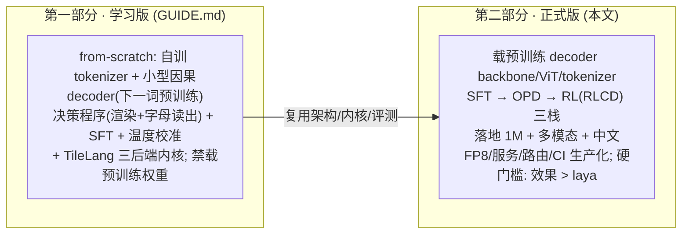
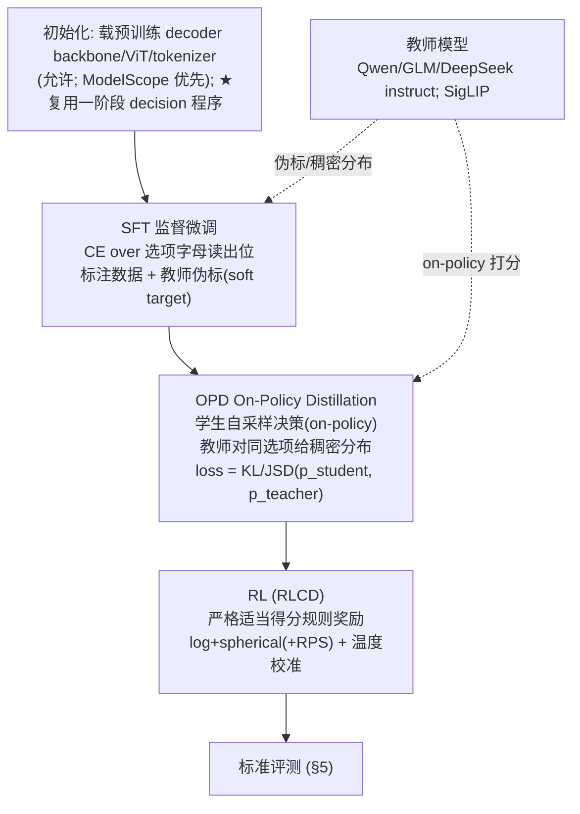
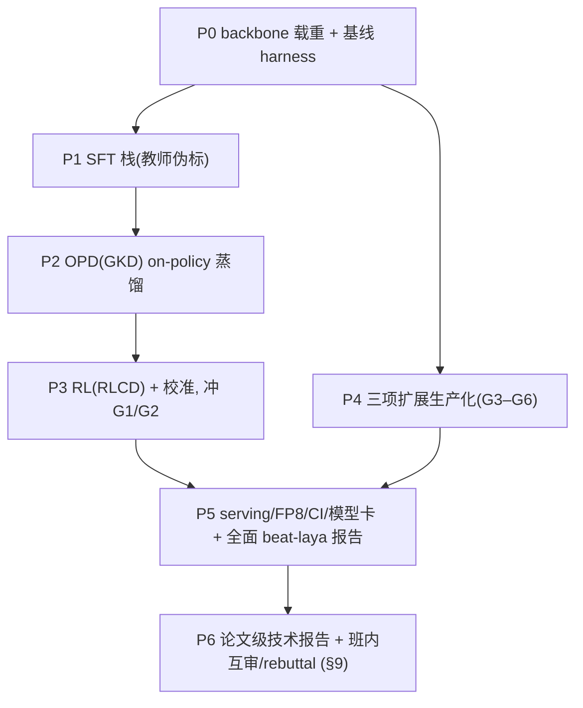

# deep-multimodal-laya (DML) — 第二部分：正式版升级指南 (PRODUCTION)

> 第一部分 [`GUIDE.md`](GUIDE.md) 是**学习版**：真·从 0 到 1、禁载任何预训练权重、重过程。
> 本文档是**第二部分·正式版**：把项目从"能跑通"升级为"真能打"——**允许加载预训练权重与训练框架**，用 **SFT / RL / OPD** 三栈训练，硬门槛是 **0.8B 规模下同时优于 laya 与 StartLux-0.8B（Jev 为参考上限）**，并把三项扩展（1M / 原生多模态+中文 / 跨硬件生产化）在本阶段落地。
>
> 两轨在**同一仓库、同一架构（因果 decoder + 选项字母读出）**下维护，共用 `dmlaya/{decision,kernels,eval,data}`（目录见 §4，标准评测见 §5–§6）。

---

## 0. 两部分的关系与升级契约



| 维度 | 学习版(第一部分) | 正式版(第二部分) |
|---|---|---|
| 权重来源 | **仅自训**（红线） | **允许**加载预训练 decoder backbone/ViT/tokenizer + 教师模型 |
| 训练栈 | 下一词预训练 + 决策 SFT + 温度校准 | **SFT + OPD + RL(RLCD)**（§2） |
| 成功判据 | 链路跑通 + 学习信号（过程） | **0.8B 规模、同 harness 下优于 laya 与 StartLux-0.8B**（Jev 为参考） |
| 交付形态 | 可复现脚本 + 报告 | + **可服务**（FP8/跨后端/路由/模型卡）+ **论文级技术报告（§9，run 级证据链）** |
| 评分 | 重过程 | **重指标达标 + 工程质量** |

> **升级契约（同构换脑）**：正式版**必须原样复用**学习版产出的 `dmlaya/{decision,kernels,model,eval,data}`——尤其 `decision/`（渲染+字母读出+温度）是两阶段的桥梁，不得另起炉灶；变更仅限"把自训小 GPT 换成预训练 decoder backbone"。学习版证明"懂原理"，正式版证明"做得好"。

---

## 1. 正式版目标与硬性验收

**一句话**：在同一定型化评测（§5–§6）下，以 **0.8B 级 backbone** 同时胜得过 laya 和 StartLux-0.8B，并在三项扩展上全面领先（两基线均不具备）。

**规模锚点**：所有 gate 统一在 **0.8B 级 backbone**（总参 0.6–1.2B，如 Qwen3-0.6B/0.8B 级）上度量；更大规模只进 G8 scaling 曲线，不参与 gate。

**基线数字（公开参考值，bf16；gate 以亲跑为准）**：

| 系统 | JevBench public (/231) | Intern avg | DI 0.2.1 | 3-field 延迟 |
|---|---|---|---|---|
| laya | 130 | 57.77 | 6.04 | —（kernel 仅 CUDA） |
| **StartLux-Decision-0.8B** | **179** | **85.03** | **38.86** | 12.2 ms（H200） |
| Jev 1.13（**参考上限，非 gate**） | 199 | 88.74 | 57.91 | 64.0 ms（API server time） |

（引自 StartLux README 与其实测；Jev 无公开权重，另见 typed-decisions 卡面 acc 0.727、teacher 自一致上限 0.735。）

> **难度定位（防止误读分数差）**：38.86 vs 6.04 的差距主要来自**路线适配**（因果 LM 字母读出 vs encoder-marker 在该套件协议下）与**backbone 起点**——这两项已由一阶段同构架构与二阶段载入同级开源 0.8B 免费解决。因此 G1 对 StartLux-0.8B 属"载入后的**复现-加**"目标，真实增量在**数据配方**（StartLux 训练数据未公开，需自采 Intern-Decision suites train 划分 + typed-decisions train + 教师伪标构建等效数据）与三栈调教；本阶段的硬活在 G3–G6 与 G8（StartLux 均未做的方向）。

| # | 验收项 | 判据（同 harness；laya 与 StartLux-0.8B 为双强制基线，Jev 为参考） |
|---|---|---|
| G1 | 决策质量（双基线） | typed-decisions 等核心集 **≥ laya 微调基线（0.766 参照）**，且 Intern avg / JevBench public / DI 0.2.1 **≥ StartLux-Decision-0.8B（85.03 / 179 / 38.86）**；效率同报对照 StartLux-0.8B（12.2ms@H200） |
| G2 | 校准 | ECE **≤ laya 同域**；弃权风险曲线不差于 laya |
| G3 | 中文 | 中文决策/理解集**显著优于 laya**（laya 中文会崩；StartLux-0.8B 非中文专项，同列对照）→ 达可用线（§5） |
| G4 | 1M 上下文 | 长文 needle/LongBench 达标且**不 OOM**（laya 无此能力）。**难度可控**：模型侧依托载入的长上下文 backbone，工程侧难点见 §7/§8（跨端 kernel、state 复用、自建评测） |
| G5 | 原生多模态 | 图文决策（MMBench-CN/OCR/GUI）达可用线（laya 纯文本） |
| G6 | 跨 MPS + 昇腾 | 三后端可跑、数值一致、性能达标（laya kernel 仅 CUDA） |
| G7 | 训练栈完整 | SFT/OPD/RL 三栈均有实现与消融，证明各自增益 |
| G8 | **Scaling 曲线（锐化）** | 报 ≥3 个规模的"规模→质量"曲线，标注**追平 StartLux-0.8B 与 G1–G3 全达标的最小规模**（gate 锚定 0.8B）；越小越优，计入加分。防"大模型必赢"的低信息量结论 |

> **反作弊**：laya 与 StartLux-0.8B 双基线须由学生**在同一 eval harness、同一数据切分与采样参数**下亲自跑分产出，不接受转抄数字（StartLux 权重 CC BY-NC，课程/科研使用允许）；Jev 无公开权重，仅作卡面数字参考列。

---

## 2. 训练栈：SFT / OPD / RL

推荐顺序 **SFT → OPD → RL**（先冷启动，再稠密蒸馏，最后对齐任务奖励与校准）。



| 栈 | 定义（laya 决策式下的具体形态） | 数据 | 损失/奖励 |
|---|---|---|---|
| **SFT** | 在**选项字母读出位**做交叉熵冷启动（与一阶段 S2 同一套 loss，仅换 backbone） | 标注 typed-decisions + **教师伪标**（大模型产 out-of-domain 标签/理由→soft target） | CE(选项) |
| **OPD** | **On-Policy 蒸馏**（≈ TRL **GKD**）：学生**自采样**决策轨迹/状态，教师对**同一组选项**给稠密分布，学生最小化散度 | 在线生成（on-policy 采样器） | reverse-KL / JSD(p_s ‖ p_teacher)；可混合 ground-truth |
| **RL** | **RLCD**：严格适当得分规则奖励微调，收敛到校准良好分布（laya 核心方法，见 `common.proper_reward`） | 与 SFT 同域 + 可验证奖励集 | log score + spherical +（score 类 RPS）；advantage 归一 |

> **为何这个顺序**：SFT 给强先验（含教师知识）→ OPD 用**稠密**教师信号在学生**自己的分布**上纠偏（比稀疏 RL 更省样本、更稳）→ RL/RLCD 对齐**任务真值 + 校准**。三者互补，消融(G7)须量化每段增益。
> **OPD 说明**：本文 OPD = On-Policy Distillation。判别式实现要点：学生产生 top-k 选项分布作 on-policy 样本，教师对同选项集输出归一化分布，逐状态做 KL/JSD；多轮场景沿用 `ep_group/ep_step`。

---

## 3. 允许使用的预训练资产与框架（ModelScope 优先）

| 类别 | 用途 | 候选（ModelScope 优先，HF 兜底） | 备注 |
|---|---|---|---|
| **Decoder backbone** | 替代一阶段自训小 GPT 做初始化（**同构换脑，不换骨架**） | **gate 锁 0.8B 级**：Qwen3-0.6B/0.8B 级（魔搭可得）；G8 曲线另取 1–2 个更大规模点 | 记录来源+commit |
| Vision encoder | 替代从零 ViT | SigLIP / CLIP ViT（ModelScope 有镜像） | 冻结→解冻两段 |
| Tokenizer | 中英共享 | 复用成熟多语 tokenizer | 加 image/video/mask 特殊 token |
| **文本教师模型** | SFT 伪标 + OPD 稠密分布 | Qwen2.5/Qwen3、GLM、DeepSeek instruct（ModelScope 可得） | 须能就 typed 选项输出分布/打分 |
| **视觉教师** | 图文伪标 | 大型 VLM（Qwen-VL / GLM-V 等） | 截图/文档决策 |
| 训练框架 | 三栈落地 | HF Transformers/**TRL**（SFT/GKD/GRPO/PPO）、ModelScope **ms-swift**、LLaMA-Factory、DeepSpeed/FSDP | **GKD ≈ OPD** |
| 服务框架 | 部署 | vLLM / SGLang / laya 式 `serve`/`mcp` | FP8、spec |

> 与学习版红线冲突处：**本条许可仅适用 `production/` 轨**；`learning/` 轨仍严禁载权重（见 §11）。

### 3.1 逐栈参考地图（文件级；参考仓 `bash refs/clone.sh` 一键入 `refs/`）

| 栈/阶段 | 去哪里看（按顺序） |
|---|---|
| P0 载重 + 基线 | 载入与快校验：`StartLux-Decision/startlux_decision/model.py` 的 `load_model`/`fast_kernels_active` + `check.py`；laya 亲跑基线：`laya/laya/serve.py` 起 `/v1/systemone` 后用 `eval/baselines/` 录入 |
| P1 SFT | **超参直接照抄**：`StartLux-Decision/finetune/finetune_lora.py`（LoRA r16/α32/dropout0.05/lr1e-4/5% warmup/cosine/2ep/micro-batch 16384 tok×4 accum，loss=读出位 CE）；温度：`finetune/calibrate.py`；教师伪标：`teachers/` 接口 = 同一套 `jevfmt` 渲染→教师末位字母分布 |
| P2 OPD | **直接用 TRL 的 GKD**（`GKDTrainer`/`GKDConfig`，库内现成 ≈ OPD）；on-policy 采样复用一阶段 `decide_batch`；教师打分接口同 P1 |
| P3 RL | 奖励：`laya/laya/common.py` 的 `proper_reward`（log+spherical+RPS）与 `td_lambda_targets`；温度分桶：`laya/laya/calibrate.py` 的 `fit_temperature_map`（另一流派：StartLux 网格法） |
| P4-1M | 读出工程：`StartLux-Decision/startlux_decision/model.py`（`PAD_LENGTHS` ladder、`GRAPH_LENGTHS`、共享 pool 的 `_capture`、graph/急切 `self_test`、`_wide` 票选）；前缀/状态复用思路：同目录 `mlx_model.py`；注意力机制：`Naive-N0.5-Flash/{config.json,modeling_naive_n05_flash.py}`（SWA 128、indexer Top-2048、sink bias）；跨端 kernel：回 `tilelang/examples/flash_attention/` + TileKernels 范式 |
| P4-多模态 | ⚠️ **工作区内无本地参考**（Naive/laya/StartLux 均纯文本）→ 看 GLM-5.3-Flash `vision_config`（24 层 ViT/patch14/448/2×2 merge/temporal2，ModelScope `ZhipuAI/GLM-5.3-Flash`）与 SigLIP；装配接口承一阶段 `dmlaya/decision/render`（state 段嵌 image token） |
| P4-中文 | 数据见 §5.2；tokenizer 复用 backbone 词表；评测协议同 §6 |
| P5 服务/FP8 | 服务：`laya/laya/{serve.py,mcp/}` 与 `StartLux-Decision/startlux_decision/{server,gguf_server}.py`（"决策程序不进权重"的前挂范式）；**FP8 三坑**见 `StartLux-Decision/docs/inference.md`（短输入反慢 2.7×、padding→NaN、小模型 Q4 掉点）；延迟协议：`eval/latency.py` |
| 评测工程/数据纪律（贯穿 P0/P3/P6） | `refs/jev-cookbook/main/06_模型评测/benchmark/`：231 题三级 tasks、`adapters/{typesafe,laya_local,openai_compat}.py`、`metrics/ledger/compare`（双基线亲跑与"无重试无回退+预算记账"的结构范本）；`main/10_本地模型/`：中文合成数据管线 `generate_synthetic_data.py`、`experiments/` 三臂对照（head-only/sft/rlcd）+ `RLCD_DIAGNOSIS.md` 失败诊断（`runs/` 档案范本）。⚠️ 该仓 CC BY-NC-SA：**按思想重写，禁拷贝文件入仓** |

---

## 4. 项目统一目录结构（两轨共享）

> 单一真源。**学习版 = `learning/` 专用脚本；正式版 = `production/` + `serving/` 专用；`dmlaya/`（内核/架构/评测）两轨共用。** GUIDE.md §3 与本文一致。

```txt
deep-multimodal-laya/
├── GUIDE.md                      # 第一部分 · 学习版手册
├── PRODUCTION.md                 # 第二部分 · 正式版手册（本文）
├── dmlaya/                       # ★ 共享实现（两轨复用，勿分叉）
│   ├── common.py model.py calibrate.py router.py backends.py
│   ├── decision/ lang/ vision/ layers/ kernels/ # ★ decision(渲染/读出/温度,两轨桥梁) + 架构 + TileLang 内核
│   ├── data/                     # 数据 schema/装配(两轨共用)
│   ├── eval/                     # ★ 标准评测 harness(单一真源)
│   │   ├── registry.py           #   benchmark 注册: ModelScope/HF 后端 + 版本/切分 pin
│   │   ├── quality.py calibration.py longctx.py multimodal.py speed.py parity.py
│   │   └── baselines/            #   laya 基线跑分(gate 对照, 同 harness 自产)
│   └── testing/                  #   torch_ref + bench
├── learning/                     # ★ 第一部分专用: from-scratch(禁载权重)
│   ├── s0_tokenizer.py s1_pretrain_gpt.py s2_decision_sft.py s3_calibrate.py
│   └── configs/                  #   小规模课程配置
├── production/                   # ★ 第二部分专用: 载权重 + SFT/OPD/RL
│   ├── assets.py                 #   预训练 backbone/tokenizer/ViT/teacher 装载
│   ├── sft.py  opd.py  rl_rlcd.py
│   ├── teachers/                 #   文本/视觉教师适配(prompt→选项分布)
│   ├── train.py                  #   编排 SFT→OPD→RL
│   └── configs/                  #   正式规模配置
├── serving/                      # ★ 正式版部署: FP8/量化/graph/router/HTTP/MCP + 跨后端
├── runs/                         # ★ 实验 lab notebook（论文证据链，规范见 §9.1）
├── report/                       # ★ 技术报告 LaTeX + 评审记录（§9.2/§9.3）
├── examples/ tests/ docs/        # docs/ 含评测报告(必附 laya 基线对照表)
└── pyproject.toml
```

---

## 5. 标准化数据集与 Benchmark（认可度优先 · ModelScope 尽量可获取）

> 原则：**先认可度、后镜像**。ModelScope 有则优先（国内可复现、离线友好），无则用其原始权威版本（HF/官方）并在 §6 pin 版本与 commit。下列为**候选**，具体 id 需二次确认可用性与许可。
>
> **pin 实践照抄 `StartLux-Decision/eval/fetch_benchmarks.sh`**：Intern-Decision @ `2f81580`、jevbench @ `7ce310c7`、typed-decisions @ `f7a2487e`，并用**上游同款打分器**（`score_task`/`brier`/`ece_top_label`）保证可比；Decision Index 用其官方 kit（`apolinario/decision-index` 0.2.1，批跑参考 `eval/di/batched.py`）。
>
> **ModelScope 镜像（API 实测）**：✅ `AI-ModelScope/fineweb-2`、`AI-ModelScope/fineweb`、`AI-ModelScope/wikipedia`、`modelscope/SkyPile-150B`、`facebook/xnli`（同名）、`opencsg/Fineweb-Edu-Chinese-V2.2`；❌ typed-decisions、MASSIVE、CLUE 系、CMMLU、LongBench、MMBench、OCRBench 系未搜到现成镜像——benchmark 三件套本就走 GitHub（境内可达）/HF 源，上述镜像适用于训练语料。

### 5.0 获取与运行（照抄即得；脚本参照 `StartLux-Decision/eval/`）

```bash
# ① 拉取三大基准（pin 到 commit，与社区数字可比）
git clone https://github.com/InternLM/Intern-Decision.git bench/intern-decision && (cd bench/intern-decision && git checkout 2f81580)
git clone https://github.com/fstandhartinger/jevbench.git bench/jevbench && (cd bench/jevbench && git checkout 7ce310c7)
python -c "from huggingface_hub import snapshot_download as s; s('LocalLLaMA/typed-decisions', repo_type='dataset', revision='f7a2487e', local_dir='bench/typed_decisions', allow_patterns=['all/*'])"
# 布局: bench/intern-decision/benchmarks/accuracy-v1/ 下 {jevbench/{easy,original,hard}, typed_decisions, toolace, agnews, wildjailbreak}/*.jsonl

# ② 跑分与打分（predict 支持 --model 本地 或 --endpoint 任一 /v1/systemone 服务）
python eval/suites.py predict --endpoint http://127.0.0.1:8090 --out preds/dml && python eval/suites.py score preds/dml
python eval/typed_decisions.py predict --model <path> --out typed.jsonl && python eval/typed_decisions.py score typed.jsonl
# 校准 pilot(已知分布 96 问) 用 bundle 自带打分器:
cd bench/intern-decision && python -m src.eval.score_known_distribution --dataset benchmarks/known-distribution-pilot-v1 --predictions ../../pilot.jsonl --output ../../pilot_out

# ③ Decision Index（官方 kit，套件不可再分发；约 7GB，需同意 HLE 条款）
python -m decision_index run --engine eval.di.<your_engine> --option model=<path> --suite-dir <suite-0.2> --out runs/dml
python -m decision_index score --results runs/dml/results.jsonl --suite-dir <suite-0.2> --edition 0.2.1   # 0.2/0.2.1 同跑双报
```

**口径自检（写进 `eval/registry.py` 的不变量）**：
- 预测行格式 `{"id", "answers": {question: {option: p}}, "ms"}`；键约定 noul=`false/true`、score=`"0".."n-1"`、choice=criteria 键（参照 `typed_decisions.py` 的 `option_keys/to_dist`）。
- **正确性自检**：Uniform 基线须复现卡面 KL/TV/Brier = `0.444 / 0.381 / 0.238`；ECE 口径：typed=15 bins、JevBench-hard=10 bins（top-label，上游 `ece_top_label`）。
- **对照榜（typed-decisions test）**：meraGPT 0.768 / TypeSafe Jev 0.727 / teacher 上限 0.735 / Prior 0.470 / laya 微调 0.766——G1 的"优于 laya"在此表量化。

### 5.1 核心决策（对齐 laya，作 G1/G2 基线）
| 用途 | 数据集/基准 | 认可度 | ModelScope | 主指标 |
|---|---|---|---|---|
| 类型化决策(laya 原基准) | `typed-decisions`(choice/score/noul) | 高(laya 报 0.766) | 需镜像/自持 | 准确率 / ECE |
| 多语意图 | MASSIVE(zh 等) | 高 | 有/可镜像 | intent acc |
| 通用意图 | CLINC150 / Banking77 | 高 | 可 | acc/F1 |
| 蕴含/布尔(noul) | XNLI(zh) / CMNLI | 高 | ✅ `facebook/xnli`(同名)；CMNLI 走 CLUE | acc |

### 5.2 中文（G3，laya 会崩 → 正式版须达可用）
| 用途 | 数据集/基准 | 认可度 | ModelScope | 目标 |
|---|---|---|---|---|
| 中文理解/知识 | **C-MMLU / CMMLU**、C-SimpleQA | 高 | 有 | 决策化后 acc 达线 |
| 中文分类/NLI | **CLUE**(afqmc/tnews/ocnli/c3)、SuperCLUE | 高 | 有 | acc ≥ laya-zh +Δ |
| 中文情感/审核/路由 | chnsenticorp、C-SPEED、工单/审核造数 | 中—高 | 部分 | choice/noul acc |
| 法律/金融(选做) | LawBench / FinanceBench-zh | 中 | 有 | 领域决策 |

> 获取：CMMLU=`haonan-li/cmmlu`；CLUE 系（tnews/ocnli/chnsenticorp 等）走 cluebenchmark 官方仓；LawBench 官方仓。魔搭实测无现成镜像（见 §5 头），接入前站内同名搜索再确认 license 与 split。

### 5.3 多模态（G5，laya 纯文本 → 严格占优）
| 用途 | 数据集/基准 | 认可度 | ModelScope | 目标 |
|---|---|---|---|---|
| 通用 VQA/图文 | **MMBench(CN/EN)** | 高 | 有 | 决策化 acc |
| 中文多模态 | CMMLU-V / Chinese-MMBench | 高 | 有 | acc |
| 文档/OCR | **OCRBench / DocVQA / ChartQA / InfoVQA** | 高 | 有/镜像 | grounding/acc |
| 中文文档 | MPDocBench | 中—高 | 有 | doc 决策 |
| GUI/截图决策(贴 laya 智能体用途) | **ScreenSpot / OSWorld / AndroidWorld** | 高(前沿常用) | 部分 | 点击/状态决策 |

> 获取：MMBench=`open-compass/MMBench`(CN/EN)；OCRBench/DocVQA/ChartQA/InfoVQA 以官方或 open-compass 镜像为准；ScreenSpot/OSWorld/AndroidWorld 走各自官方仓。魔搭实测未搜到上述镜像；⚠️ 工作区内无多模态参考实现（见 §3.1），数据 schema 自行对齐 `/v1/systemone`。

### 5.4 长上下文（G4，laya 无 → 严格占优）
| 用途 | 数据集/基准 | 认可度 | ModelScope | 目标 |
|---|---|---|---|---|
| 综合长文 | **LongBench / LongBench-zh** | 高 | 有(THUDM) | 达标 |
| 超长/1M | **∞Bench(InfiniteBench)** / RULER / Multi-Needle | 高 | 有/可 | needle 召回(256K/1M) |
| 状态截断回归 | 自持合成(由 laya `predict_long` 升级) | — | 自建 | marker 命中 |

> 获取：LongBench=`THUDM/LongBench`(含 zh)；InfiniteBench(∞Bench)/RULER 以官方同名仓为准；魔搭实测无 LongBench 镜像，走 GitHub/HF；Multi-Needle 与"状态截断回归"自建合成（seed 固定入 registry）。

### 5.5 校准与效率
- **校准**：ECE / 可靠性图 / 弃权风险曲线，套用 5.1–5.4 各集（laya 协议）。**这是 laya 的强项，G2 须不劣于 laya。**
- **效率&一致性**：tok/s、P50/P99、峰值显存，CUDA/MPS/昇腾三后端各测；跨后端 argmax 一致 + bf16 err≤2e-2。**速度对照必须同设备**：laya 的 kernel 仅 CUDA，在 Mac 上跑 laya 速度基线无效——MPS 只比质量，速度仅在 CUDA 上报。

---

## 6. 评测协议（标准化，单一真源）

1. **唯一 harness**：所有跑分走 `dmlaya/eval/`，禁止各轨自带评分。
2. **pin 版本**：`eval/registry.py` 对每个数据集固定 split/commit/采样参数（`temperature/top_p`）、随机种子；报告附 `bench/` 各仓 `git rev-parse HEAD` 与数据集 revision 清单（自动生成）。
3. **数据四分与 locked test**（方法源自 `refs/jev-cookbook` 第十章，重写实现）：每条样本按**来源组隔离**后划入 Train / Dev（选 checkpoint）/ Calibration（拟合温度与阈值）/ **Locked Test（只允许一次最终评测，出报告即封存）**；温度永远不在训练集或 test 上拟合。
4. **双基线强制**：`eval/baselines/` 下由学生**同 harness 亲跑 laya 与 StartLux-0.8B** 产出对照表（G1–G3 以此为 gate）；Jev 1.13 作参考列引卡面数字。
5. **报告规范**：`docs/` 出统一结果表——`{metric, DML, laya-baseline, startlux-0.8B-baseline, Δ, (Jev 参考列)}` + 可靠性图 + 失败/边界分析；数字变动 before/after。
6. **可复现**：`examples/` 一键复现评测；标注硬件与库版本。
7. **设备公平**：每个速度数字注明设备与精度模式；laya 速度基线仅 CUDA 有效（同设备对照，见 §5.5），MPS/NPU 仅报 DML 自身。

---

## 7. 生产工程要求

| 项 | 要求 |
|---|---|
| 服务化 | `serving/` 提供 HTTP/MCP（承 laya `serve`/`mcp`）；批量 + 流式 |
| 精度/显存 | FP8 权重（e4m3+动态激活）为默认；给出 BF16 回退；MPS fp16 回退 |
| 长上下文 | **优先复用 backbone 原生长上下文**（Qwen3.5 式线性注意力）：CUDA 直接用 flash-linear-attention/causal-conv1d；**MPS/昇腾由 TileLang 补滑窗/线性注意力 kernel**（StartLux 参考仅到 64K，且 fla 无非 CUDA 版）；1M 读出走**前缀/KV 复用**压 state 重复渲染成本（StartLux 仅 MLX 端验证）；KV/显存实测 |
| 路由 | `router.py` 语言/任务/模态路由（中文 vs 多语 vs 视觉），带决策依据 |
| 跨后端 | `_kernel/_cuda/_mps/_asc` 三件套 + `backends.py` 运行时探测；CI 跨后端矩阵 |
| 门控 | `min_confidence` 弃权/升级；校准不合格即拦CI |
| 模型卡 | 记录 backbone/teacher 来源与 commit、训练栈超参、六轴指标、诚实边界 |
| CI | lint + 单元 + 跨后端 skip 门控 + 评测回归（关键指标不得跌破 gate） |

---

## 8. 里程碑与难度评估（正式版）

### 里程碑


| 阶段 | 难度 | 人周 | 风险 |
|---|---|---|---|
| P0 载 backbone + laya 基线 harness | ★★ | 1 | laya 环境/复现 |
| P1 SFT | ★★★ | 2 | 伪标质量、模板化 |
| P2 OPD(GKD) | ★★★★ | 2.5 | on-policy 采样器、教师打分接口、稳定性 |
| P3 RL(RLCD)+校准 | ★★★ | 2 | 方差/发散、校准 gate |
| P4 扩展生产化(1M/多模态/中文/跨后端) | ★★★★ | 3–5 | 1M 难度已转移为**工程项**：线性注意力 kernel 跨后端(fla 仅 CUDA)、state 重复渲染成本、1M 评测自建；多模态/中文为常规截 |
| P5 服务/FP8/CI/模型卡 | ★★★ | 2 | FP8 掉点、部署矩阵 |
| P6 技术报告 + 互审 rebuttal | ★★★ | 2 | 数字与 runs 对不上（§9.1 溯源即解）、图表不规范 |

> 相比学习版，正式版**降低了"从零收敛"的科研风险**（载权重），但**抬高了系统工程与达标门槛的风险**（beat-laya + 生产化）。建议 2–4 人/组、**8–12 周**（含报告与互审约 2 周）。

### 8.1 算力预算（数量级参考，**开课前必须先修(pilot)实测校准**）

| 项 | GPU·h（单张 H200/4090 级） | 说明 |
|---|---|---|
| 一阶段 S1 预训练（50–150M × 0.5–5B tok） | ~10–60 | ≈6ND×2–4 倍 MFU 折损；**MPS 只做冒烟，不当主训** |
| 一阶段 M1 内核开发/对拍 | 5–10 | 编译+调试循环 |
| P1 SFT（0.8B 级 LoRA × ≤10万样本，含 G8 另 1–2 规模点） | 5–25 | 0.8B gate 使主力训练便宜；多规模点供曲线 |
| P2 OPD | 20–60 | 教师推理占大头；**教师分布可离线缓存**压成本 |
| P3 RL(RLCD) | 20–50 | 噪声采样×4 + advantage 归一的 batch 开销 |
| P4 扩展（多模态衔接/1M 数据管线） | 10–40 | 1M needle 前向便宜，贵在建管线 |
| Decision Index 全套 | ≈2/模型 | 实测 StartLux-4B≈1.9 GPU·h（8卡 25min）；套件下载 ~7GB |
| P5 服务/FP8 | 5–15 | |
| **两阶段合计** | **≈80–260 GPU·h/组** | 存储峰值 ~100–500GB（取样语料+bench）；硬件前置：每组 ≥1 张 24GB CUDA，Mac 建议，昇腾由课程方提供 |

---

## 9. 实验记录与技术报告（论文级要求）

> 二阶段的最终交付不是"一张分数表"，而是一份**可溯源的技术报告（arXiv tech-report 风格）**。铁律：**报告中的每一个数字必须能追溯到 `runs/` 下的 run 目录；无 run-id 的数字视为捏造，按学术不端处理。**

### 9.1 实验 lab notebook（`runs/`，过程记录，禁止事后补记）

```txt
runs/<MMDD>-<exp-id>/             # 如 1015-sft-q4b-seed3
├── config.yaml                   # 全量超参 + git commit + 数据 revision pin + 硬件
├── metrics.jsonl                 # loss/acc/ECE/latency 定时记录（曲线唯一真源，禁止为画图重跑）
├── system.json                   # GPU/驱动/torch/tilelang 版本
├── stdout.log
└── notes.md                      # 三行必填：假设 → 观察 → 结论（失败也要记）
```

- **强制记录节点**：三栈各 ≥2 个消融（或 3 seeds）；温度校准前/后；G8 每个规模点；长文每档窗口/Top-K 的 needle 点；多模态"加图/去图"对照点；三后端全量六轴。
- 工具：以 `metrics.jsonl` 文件为**唯一真源**；wandb/tensorboard 仅作可选镜像，**不得以托管服务作为唯一记录**（呼应红线）。
- 负结果也必须入库：`notes.md` 有结论行，报告 Limitations 须引用 ≥3 个失败分析。

### 9.2 技术报告规范（`report/`）

| 项 | 要求 |
|---|---|
| 体裁 | LaTeX，arXiv tech-report 风格 8–12 页 + 附录；英文优先（与工程红线一致） |
| 结构 | Abstract → Intro（claim–evidence 成对）→ Related Work（须如实引用 laya/Jev/StartLux/Intern-Decision/Decision Index/Naive/GLM 多模态，不藏竞品）→ Method（架构图+三栈管线图）→ Setup（数据 pin 表 + harness + 算力）→ Results（六轴主表 + G8 规模曲线 + 消融表）→ Analysis（可靠性图/跨后端/失败案例）→ **Limitations（必填，含负结果）**→ Appendix（runs 索引 + 复现指南） |
| 数字规范 | 每图每表脚注标 run-id；均值报 3 seeds 或 bootstrap 95% CI；"更好/更快"必须带 Δ 与方差；claim 与证据逐条配对 |
| 必交图表 | 架构图、三栈管线图、规模→准确率曲线（G8）、校准前后可靠性图（G2）、SFT/OPD/RL 消融表（G7）、三后端一致性表（G6） |
| 交付 | PDF + LaTeX 源码 + `runs/` 索引 + `examples/` 一键复现（评审可复跑主表） |

### 9.3 同行评审训练（必修）

班内交叉评审：每组审 2 份他组报告（结构化审稿单：摘要/优点/缺点/问题，1 页），作者 rebuttal 一轮后交 final。**审稿质量计入成绩**（敷衍审稿扣分）——写论文与审论文是同一种严谨性的两面。

---

## 10. 评分标准（正式版 Rubric，总分 100）

| 维度 | 权重 | 说明 |
|---|---|---|
| **G1 决策 ≥ laya & StartLux-0.8B** | 16 | 同 harness 亲跑双基线并超越（0.8B 级） |
| **G2 校准 ≥ laya** | 9 | ECE/弃权不差于 laya |
| **G3 中文领先** | 11 | 中文集显著优于 laya |
| **G4 长上下文** | 11 | 达标 + 不 OOM + 实测 |
| **G5 多模态** | 11 | 图文/OCR/GUI 达可用 |
| **G6 跨后端生产** | 7 | 三后端一致 + serving |
| **G7 三栈完整 + 消融** | 11 | SFT/OPD/RL 各自增益有量化 |
| **G8 最小胜出规模** | 4 | ≥3 规模曲线 + 追平 StartLux-0.8B 的最小规模标注 |
| 工程质量/模型卡/CI | 6 | 服务、复现、文档 |
| **实验记录与证据链（§9.1）** | 6 | runs 完整/强制节点齐全/每数字可溯源/负结果入库 |
| **技术报告与互审（§9.2/§9.3）** | 8 | 结构图表达标、claim-evidence 配对、审稿质量 |
| 加分项 | +5~15 | 真冲 1M、FP8 不掉点、超越更多基线、报告达可公开 arXiv 质量 |

---

## 11. 红线与诚实边界

0. **数据不得编造**：报告/答辩中每个数字必须可溯源到 `runs/`（§9.1）；抽查复现不出 = 学术不端，一票否决。
1. **载权重仅限 `production/` 轨**：`learning/` 轨仍严禁第三方权重（GUIDE §7-0 不变）；两轨不得互相污染配置。
2. **基线必须亲跑**：不接受转抄 laya 数字；laya 与 DML 同 harness、同 split、同采样。
3. **可复现优先**：数据集/模型版本 pin 到 commit；seed、硬件、库版本随报告。
4. **端侧可服务**：正式版本体仍须能在自有硬件部署；外部仅可作**教师**（离线产标/蒸馏），推理链路不得依赖第三方在线 API。
5. **诚实边界**：报告列 FP8 掉点、纯视觉弱于专用 VLM、某后端算子受限等退化场景。

---

### 一句话总纲
> **学习版练"从零能造"，正式版求"0.8B 同量级打赢 laya 与 StartLux、写得出一篇可溯源的论文"**：复用同一内核与标准评测，用 **SFT→OPD→RL** 把三项扩展做成生产可用，同 harness 双基线取胜（Jev 为参考上限），并以 **runs 证据链 + 论文级报告 + 同行评审**收尾。
