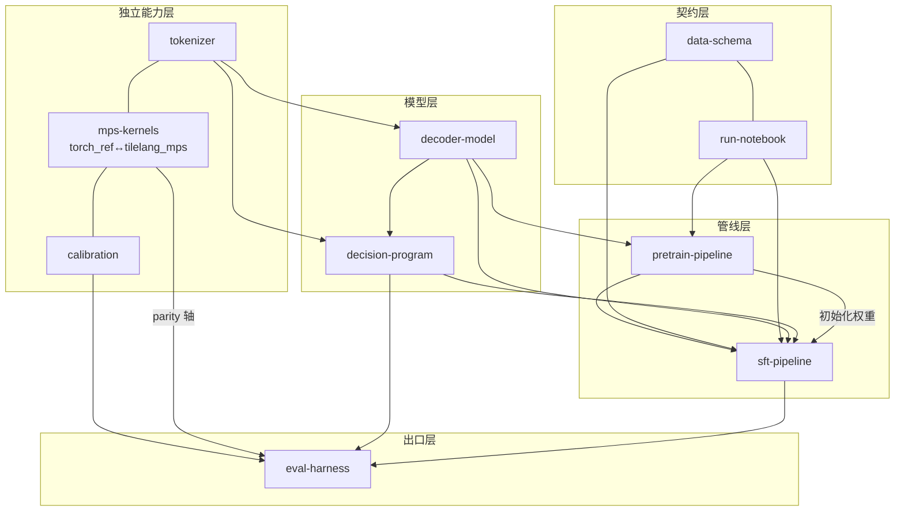

# Design: teacher-p1-scratch-mps — 一阶段教师参考答案

## Context

- 仓库现状：纯规划骨架（两份手册 + 12 份 README + CI 工具链），`dmlaya/` 与 `learning/` 无实现代码；`tools/check_comments.py` 扫描 0 文件，注释门未经历真实代码检验。
- 分支格局：`pure` = 学生起始态（冻结为课程发布点）；`main` = 教师参考答案开发线（本变更落点）。
- 运行环境：macOS / Apple Silicon，torch MPS；TileLang Metal 方言（`tilelang.metal.language`）已由上游 `benchmark/matmul_metal` 验证存在。
- 双重身份：既是 GUIDE 一阶段的参考答案，又是《Agent Driven Software Engineering》课程的典型过程样本——**执行轨迹（openspec 变更、波次并发、孙任务验证、runs 证据）与产物同等重要**。

## Goals / Non-Goals

**Goals:**

1. 跑通一阶段全部核心基础流程：S0 分词器 → S1 从零预训练（Mac 冒烟档）→ S2 决策 SFT → S3 温度校准 → M1 TileLang MPS 内核 → M3 评测报告。
2. 产物满足 GUIDE §6 验收：SFT 后超分桶随机基线、ECE 校准后改善、MPS 对拍 argmax 一致、一键复跑。
3. 教师版代码成为注释规范（GUIDE §6.1）的**示范级样本**：白话段落可作讲义直接引用。
4. 子领域间不耦合，可多 Agent / 多人并发执行；每孙任务独立可验证。

**Non-Goals:**

- `_cuda` / `_asc` 方言、跨后端 `backends.py` 探测分发（教师版仅 MPS 单后端）。
- 模型质量冲刺（预训练 loss SOTA、choice ≥0.6 参考线不作 gate，只作过程信号）。
- M2 RoPE 扩窗课程、1M、多模态、RL（归二阶段 change）。
- 任何第三方预训练权重。

## Decisions

### D1 分层与依赖方向（架构不变量）

规则：依赖只准自上而下；契约层与独立能力层**互不依赖**；`decision-program` 不得 import `decoder-model` 内部（只依赖"末位 hidden × 字母行"接口）——这是两阶段同构桥梁的落地形态。

### D2 子领域拆分（10 个，不耦合原则）

| # | 子领域 | spec 能力 | 一句话边界 | 外部依赖 |
|---|---|---|---|---|
| 1 | 样本契约 | `data-schema` | `{state,questions,targets}` 校验/序列化/soft 分布 | 无 |
| 2 | 实验记录 | `run-notebook` | runs/ 三件套 + run-id 生成与工具 | 无 |
| 3 | 分词器 | `tokenizer` | 自训 BPE + 26 字母单 token 强校验 | `tokenizers` |
| 4 | 内核对拍 | `mps-kernels` | torch_ref 与 TileLang MPS 逐算子对拍 | `tilelang` |
| 5 | 校准数学 | `calibration` | NLL 网格温度 + ECE + 分桶基线 | 无 |
| 6 | 解码器 | `decoder-model` | GPT 式因果 decoder（RoPE+MLP）配置化定义 | torch |
| 7 | 决策程序 | `decision-program` | 渲染/读出/类型温度/分组票选 | tokenizer 接口、schema |
| 8 | 预训练管线 | `pretrain-pipeline` | 语料装配+训练循环+采样验收 | 3/6/2 |
| 9 | SFT 管线 | `sft-pipeline` | 读出位 CE（soft target）微调 | 7/6/1/2 |
| 10 | 评测出口 | `eval-harness` | 四轴指标+分桶呈现+run-id 溯源 | 5/4/9 产物接口 |

不耦合判据：任一子领域可被单独删除重写而不波及他域接口（只允许经由上表"外部依赖"列声明的窄接口）。

### D3 执行编排——波次与关键路径（并发最大化）

> **运行态跟踪**：随进度更新的 mermaid 编排图见一级 `tasks.md` 首节（节点完成后标 ✅）；孙任务已全部下沉至 `changes/p1-NN-*/tasks.md`，本节为静态决策记录。

| 波次 | 子领域（可全并发） | 等待原因 |
|---|---|---|
| **W0** | 1 样本契约 · 2 实验记录 · 3 分词器 · 4 内核对拍 · 5 校准数学 | 无前置 |
| **W1** | 6 解码器 · 7 决策程序 | 需 W0 的词表规格（接口常数）与 schema；7 以 stub tokenizer 并行 |
| **W2** | 8 预训练管线 · 9 SFT 管线 | 8 需 3+6+2；9 需 7+6+1+2；8/9 互不依赖可并发 |
| **W3** | 10 评测出口 + M3 汇总 | 需 9 的产物接口 + 5 + 4(parity) |

- 关键路径：`3 分词器 → 6 解码器 → 8 预训练 → 10 评测`；次关键路径经 `7 决策程序 → 9 SFT`。
- **内核不阻主线**：4 内核对拍在 W0 独立推进；若 TileLang MPS 方言出现阻塞（编译环境/算子覆盖），`backends.py` 先回退 torch-MPS eager 路径并在 runs 记录阻塞点，主线 W2 照常推进——内核层与模型层经"算子接口"隔离，此即 D1 分层的收益。
- 集成点唯一：W2 末的"冒烟联调"（s0→s3 一键串跑，tiny 档，CPU 可跑）是全变 更第一个跨域集成验证。

### D4 合并规则（一级变更 → main）

1. **分支模型**：每子领域一支 `teacher/p1/<domain>`；波次内子领域各自独立 PR；严禁跨波次抢跑合并（W1 分支可先建，但合并须其 W0 依赖已入 main）。
2. **PR 门槛（缺一不可）**：① `bash tools/ci.sh` 全绿（ruff → 注释门 → compile → pytest CPU）；② 若触及 `@mps` 用例：`bash tools/ci.sh --device mps` 绿；③ PR 描述逐条勾选该域 spec 的 scenarios；④ 每个公共函数含 `白话：` 段落（注释门机器校验 + 人工抽查一条）。
3. **粒度规则**：一个 PR = 整数个已完成孙任务；孙任务半途不得开 PR。
4. **合并方式**：squash merge，commit 前缀 `feat(<domain>):` / `test(<domain>):`，一 commit 一逻辑。
5. **回滚**：子领域独立分支保证单域可 revert；契约层（1/2）变更须同步升版本并在 PR 中列受影响域清单。

### D5 验收标准（三级）

| 级别 | 标准 | 判定方式 |
|---|---|---|
| **孙任务级** | tasks.md 中每孙任务的"验证"行命令 exit 0 | 本地/CI 可复跑 |
| **子领域级** | 对应 `specs/<capability>/spec.md` 全部 scenarios 通过 | PR 描述逐条勾选 + 测试映射 |
| **变更级（DoD）** | ① s0→s3 一键串跑产 run-id；② SFT 后 choice 准确率 > 分桶随机基线+10pp（noul>0.6）；③ ECE 校准后较前改善（记录 before/after）；④ MPS 内核对拍 fp16 err≤2e-2 且决策 argmax 一致；⑤ `tools/ci.sh` 与 `--device mps` 全绿；⑥ GUIDE §6.1 注释门对全部新文件通过 | `examples/repro_p1.sh` + runs/ 证据 + CI |

### D6 Mac 冒烟档预训练规格

- 规模：~40M 参数（d=512, L=12, heads=8, ctx=1024）；语料 1–3 亿 token（fineweb-edu 流式 + 中文教育语料混排，比 ≈7:3）。
- 两档配置：`smoke_tiny.yaml`（~10M tok，CPU/CI 可跑，<10min）与 `mps_main.yaml`（正式冒烟，MPS 数小时级，写入 runs/）。
- 验收：loss 稳降曲线（metrics.jsonl）+ 采样可读短句（中文或英文）人工抽检入 notes.md。

### D7 决策程序硬契约（两轨同构桥梁）

- 键约定：`noul → {false,true}`；`score → "0".."n-1"`；`choice → criteria 原键`。
- `output_tokens = 0`：任何生成循环即路线错误（测试断言）。
- 右 padding 因果不变性：读出位之前无 pad（测试断言：同一样本 pad/不 pad 概率一致，容差 1e-5）。
- `RENDER_VERSION` 常量随 run config 落盘。

### D8 SFT 数据防泄漏

typed-decisions test 仅作评测；SFT 训练数据 = 转写集（XNLI-zh→noul、MASSIVE-zh→choice、星级→score）+ Intern-Decision suites train 划分。切分信息入 `dmlaya/eval/registry.py`（一阶段先立桩，二阶段补全 pin）。

## Risks / Trade-offs

- [TileLang MPS 方言算子覆盖不全（attn_sw 最险）] → D3 隔离策略：torch-MPS eager 回退保主线；对拍先行（W0）尽早暴露；阻塞点记录入 runs/notes.md 并在教师版 README 标注"学生版补 `_cuda` 时此处同源"。
- [Mac 冒烟档模型太弱，SFT 后准确率贴近随机] → DoD 只要求"超分桶基线"，不设绝对线；转写集加大 noul/choice 信号密度；若仍不达，缩小选项数（k≤5）保证信号可见，如实记录。
- [注释门（R2 白话+黑话）拖慢开发] → 教师版本就是示范，注释成本是特性不是负担；孙任务中"注释+自检"列为独立验收步骤而非事后补写。
- [MPS 训练吞吐不稳（统一内存换页）] → batch/seq 档位写入配置；smoke_tiny 档保 CI 可回归；正式档允许分片续训（checkpoint 续跑入 run-notebook 能力）。
- [并发子领域接口漂移] → D2 的"外部依赖"列即接口登记表；契约层先行合并（W0 提前入 main）压缩 W1 等待。

## Migration Plan

1. 本变更全部子领域按 D3 波次合入 main；`pure` 分支不动（学生态）。
2. 合并完成后：`openspec archive` 本变更；教师版 README 增"参考答案导览"（文件 → 手册章节 → runs 证据映射表）。
3. 回滚：单域 revert（D4-5）；全量回滚 = revert 合并 commit 序列，`pure` 永远是无损下界。

## Open Questions

- typed-decisions 获取走 HF `snapshot_download`（GUIDE §5 已给命令）——国内网络失败时备选 Intern-Decision `test.jsonl`，执行时按可用性二选一并记入 registry。
- TileLang MPS 的 bf16 支持范围待 W0 pilot 实测；不支持则统一 fp16 对拍（DoD 已按 fp16 措辞）。
