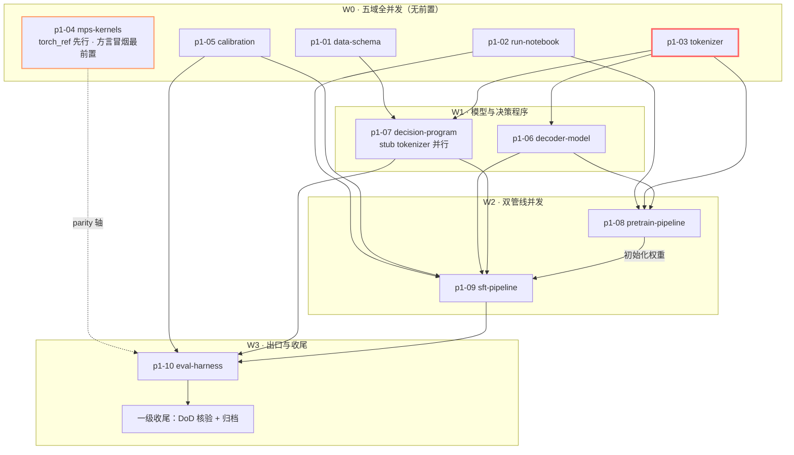

# Tasks: teacher-p1-scratch-mps — 一级编排（跟踪二级子变更）

> **一级只编排不实现**：每个二级子变更一行 checkbox（含波次/依赖/路径）；孙任务在各子变更 `tasks.md` 内。
> **波次语义澄清**：波次（W0–W3）仅为汇报分组；解锁唯一判据是 D4-1 依赖驱动——“该域声明的依赖已入 main”即可合并，不等整波。同波次域间的孙任务级前置在各子变更 tasks.md 内标注（如 p1-09.B3 需 p1-08 产物）。
> 完成判定：子变更勾选 = 其 tasks.md 全孙任务完成 + spec scenarios 全过 + 按父 design D4 合并入 main。
> 合并规则 D4 / 变更级 DoD D5 见 design.md。

## 编排跟踪图（随进度更新：完成后将节点标 ✅）

- **关键路径**（红）：`p1-03 → p1-06 → p1-08 → p1-10 → FIN`；次关键经 `p1-07 → p1-09`。
- **风险前置**（橙）：p1-04 方言冒烟是首个孙任务，阻塞即走 torch-MPS 回退，不阻主线。
- 编排要点：W0 五域全部零依赖可同时开工；契约层（01/02）与 03 合并即解锁 W1；W2 双管线互不依赖；唯一跨域集成点 = W2 末冒烟联调（repro_p1.sh 串跑）。

## 二级子变更清单

### W0（全并发，无前置）

- [x] p1-01 data-schema — 样本契约 — `changes/p1-01-data-schema/`（零依赖；产出 schema 接口）✅ 5/5 孙任务、21 测试绿
- [x] p1-02 run-notebook — 实验记录 — `changes/p1-02-run-notebook/`（零依赖；产出 RunContext）✅ 4/4、20 用例，commit 实取 git HEAD
- [x] p1-03 tokenizer — 分词器 — `changes/p1-03-tokenizer/`（零依赖；3C 真实语料可延后；**关键路径起点**）✅ 6/6 含 C1：209MB 语料 33.65s，52 字母单 token 实盘（A–Z=ids 38–63）
- [x] p1-04 mps-kernels — 内核对拍 — `changes/p1-04-mps-kernels/`（零依赖；4A torch_ref 先行合并；方言阻塞走回退）✅ 12/12：**探针结论 Metal 方言可用**（附 6 条实测坑入 kernels/README）；MPS 门 34 绿，回退场景全过
- [x] p1-05 calibration — 校准数学 — `changes/p1-05-calibration/`（零依赖）✅ 4/4，ECE 0.28→0.03 实测，基线全枚举自证

### W1（前置：W0 相应域已入 main）

- [x] p1-06 decoder-model — 解码器 — `changes/p1-06-decoder-model/`（依赖 p1-03 词表常数）✅ 5/5；因果性逐比特断言+阳性对照；带回跨域情报 rope_ref fp32 缺陷（已修+回归用例）
- [x] p1-07 decision-program — 决策程序 — `changes/p1-07-decision-program/`（依赖 p1-01+p1-03；stub 并行开发）✅ 8/8、52 用例；三快照锁渲染；stub 前向为主+真模型端到端复核

### W2（前置：W1 已入 main）

- [x] p1-08 pretrain-pipeline — 预训练管线 — `changes/p1-08-pretrain-pipeline/`（依赖 p1-03+06+02；与 09 并发）✅ 8/8；真实 run `1004-s1-smoke-tiny-b477`：loss 9.86→6.37、同 seed 复现逐字一致；采样可读性**不达标已如实记录**（过程信号非 gate）
- [x] p1-09 sft-pipeline — SFT 管线 — `changes/p1-09-sft-pipeline/`（依赖 p1-07+06+01+02；与 08 并发；孙任务级：B3 需 p1-08 的 smoke_tiny checkpoint，其余可先行）✅ 7/7；B3 双超分桶基线（noul 0.64>0.5、choice 0.64>0.333）；s3 写回 temperatures且 ECE 双改善（-0.012/-0.052）

### W3（前置：W2 已入 main）

- [x] p1-10 eval-harness — 评测出口 — `changes/p1-10-eval-harness/`（依赖 p1-09 产物接口 + p1-05 + p1-04）✅ 7/7；repro_p1.sh 实跑 exit 0（CPU 12s/MPS 19s）；quality choice +31.7pp、parity 12/12=100% tilelang；带回 readout MPS 跨设备缺陷（已修+验证）

## 一级直管任务（收尾，依赖全部子变更）

- [x] F1 全量门禁：`bash tools/ci.sh` 与 `bash tools/ci.sh --device mps` 全绿 —— ✅ CPU 274 passed + MPS 36 passed，ruff/注释/编译四门全绿（含三枚跨域缺陷修复后回归）
- [x] F2 变更级 DoD 逐项核验（design D5 六条），结果记入最终 run 的 notes.md —— ✅ run `1004-p1-dod-verification-5ce3` notes 含六条全部通过记录（含两处如实的诚实边界）
- [x] F3 教师版导览：README 增"文件 ↔ 手册章节 ↔ runs 证据"映射表 —— ✅ 13 行，逐行 run/测试可迹
- [x] F4 归档变更：`openspec archive teacher-p1-scratch-mps` —— 验证：`openspec status` 显示无活跃 change
