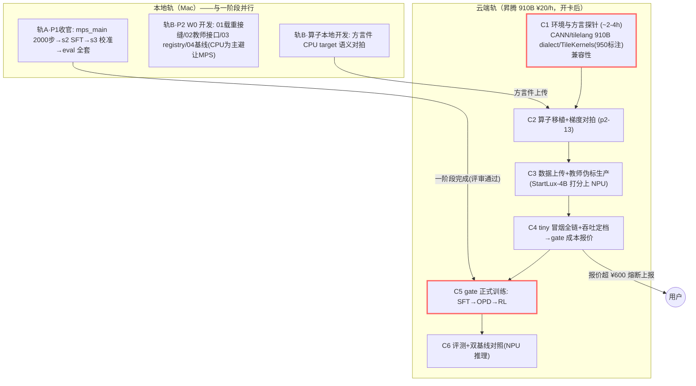

# Design: teacher-p2-production-full — 二阶段教师参考答案

## Context

- **前置**：P1 已归档于 `scratch/`（冻结只读）；本变更工作目录 `release/`，其 `sys1/` 为 P1 冻结复制基线（decision/ 等共享契约原样可用）。`decision/` 零改动是硬契约（三层守护：orchestration spec + D4-4 + 收尾 F1 diff 断言）。
- **环境（已就绪，非从零）**：`release/.venv` 已建（torch 2.14.1 / transformers 5.18.0 / peft 0.21.2 / modelscope / MPS 可用）；Qwen3-0.6B 权重已缓存 `release/bench/ms_models`（真拉 251s）；Qwen3.5-0.8B 配置已拉取实证（vision_config + 153 视觉张量 + token 三件套）。
- **可行性已实测**：`1005-probe-08b-lora-mps-feasibility-5a64`（M3 Pro 36GB）——LoRA r16 + 梯度检查点：bs8×1024 可训（475 tok/s、31GB）；无 GC 则 OOM。**GC 是硬前提**。
- **参照资产**：`refs/laya`（proper_reward/serve）、本地 StartLux-Decision（全套范式）、`refs/GLM-V`（processor/verifier 实读）、ModelScope。手册 `../scratch/PRODUCTION.md`。
- 双重身份同 P1：ADB 课程过程样本，执行轨迹与产物同等重要。

## Goals / Non-Goals

**Goals:**

1. 三栈完整（SFT→OPD→RL）各有实现、tiny run 与消融点（G7 形态；增益或负结果如实入库）。
2. 三扩展全做：中文（G3 对照 laya 崩溃列）、长上下文（Qwen3.5 原生 262K + prefix_cache 工程 + needle 双列）、多模态（自带视觉塔启用 + 最小评测 + 加/去图对照）。
3. 双基线亲跑对照表（G1 gate 基座）。
4. 证据链与报告：runs/ 全程 + LaTeX 骨架 + D9 业界参照入 Related Work。

**Non-Goals:**

- FP8 / CUDA graph / vLLM 部署 / speculative decoding（CUDA 生产化，非 MPS 教师版）。
- `_cuda`/`_asc` 方言；backbone 接入 TileLang 内核链（P1 回写边界）。
- 自研线性注意力；另载 Qwen3-Next；LLaVA 外挂为主路线；teacher 训练；LLM-judge 在线兜底为默认。
- G1 硬门槛全绿（教师版交付路径与坑图，量化"距 gate 差多少"）；G8 完整曲线（出 0.8B 主档 + 9B 扩展点配置）。

## Decisions

### D1 分层与依赖方向

不变量：`decision/` 零改动；扩展域只依赖 W0 层 + SFT 产物接口，彼此互不依赖；tech-report 只读；依赖驱动解锁（波次仅汇报分组）。

### D2 子领域拆分（12 个）

| # | 子域 | spec 能力 | 一句话边界 | 关键外部依赖 |
|---|---|---|---|---|
| 1 | 载重接缝 | `backbone-assets` | Qwen3.5-0.8B 载入+三校验+真实路径 | transformers, P1 decision（冻结） |
| 2 | 教师适配 | `teacher-adapters` | logprob 主径+answer 分域兜底+缓存 | 本地教师模型 |
| 3 | 评测注册 | `eval-registry` | pin+锚点+六轴（parity 已裁定） | HF/GitHub |
| 4 | 双基线 | `baselines-dual` | laya/StartLux 亲跑对照表 | 两基线权重 |
| 5 | SFT 栈 | `prod-sft` | LoRA+GC 读出位 CE；gate08b 实跑（910B 全自研栈） | 1/2/3/**13** |
| 6 | OPD 栈 | `opd-gkd` | per-token reverse KL+混合调度 | 5/2 |
| 7 | 长上下文 | `long-context` | 原生 262K+prefix_cache+needle 双列 | 1/3/5 |
| 8 | 多模态 | `multimodal-tower` | 自带视觉塔+一站式 processor+冻结塔 | 1/2/3 |
| 9 | 中文 | `chinese-track` | 决策化+配比消融+崩溃列 | 3/5 |
| 10 | 服务化 | `serving-systemone` | HTTP+延迟协议+缓存联动 | 5 |
| 11 | RL 栈 | `rl-rlcd` | log score+双通道 verifier+温度后置（910B） | 6 采样器/**13** |
| 12 | 报告 | `tech-report` | 骨架+索引+边界+成本报表 | 全部（只读） |
| **13** | **TileLang 昇腾算子优化（研究主线）** | `ascend-runtime` | 910B 头桩移植（原地制）/AIC 优先七算子/torch_npu 渐进替换/成本护栏；950 路线废 | tilelang 主仓, CANN 8.5.2(snt9b), torch_npu |

### D3 执行编排——三轨并行（2026-10-05 改云端版）

| 轨 | 阶段 | 子域/任务 | 前置 |
|---|---|---|---|
| 本地 A（P1 收官） | A1 | mps_main 2000 步 → s2 → s3 → eval 全套（scratch 侧，~10.5h 长跑） | 无（随时启动） |
| 本地 B（P2 开发） | W0 | 1·2·3·4（CPU 为主，避让轨 A 的 MPS）+ 13 的方言件本地 CPU 对拍 | 无（与 A 并行） |
| 本地 B | W1 | 5 的训练代码开发+CPU 冒烟（数据装配/loss/LoRA 注入自测） | W0 |
| 云端 C | C1–C4 | 13 探针→移植→数据/伪标→tiny 冒烟定档（开卡后短租分段记账） | W1 产物包 |
| 云端 C | C5 | 5·6·11 gate 正式训练（**须待轨 A 完成**，MPS 让位、预算报价已批） | A1 ✓ + C4 报价 |
| 云端 C | C6+W2 | 7·8·9·10 扩展域 + 12 报告 + 收尾 | 5 产物接口 |

- 关键路径（红）：**C1 探针 → C2 移植 → C5 SFT → C5 RL → C6 报告**；本地轨与云端探针充分并行。
- 探针风险前置：910B dialect 兼容性是最大未知（TileKernels 标 950），C1 失败即触发 torch_npu 底座回退决策（D6），不阻主线只换底座。

### D4 合并规则

1. 分支 `teacher/p2/<domain>`；波次为汇报分组，解锁=依赖入 main。
2. PR 门槛：CI 绿（release 侧用 release/.venv）；spec scenarios 逐条勾选；**每域至少一个 run-id 入 PR（无数字不合并）**；训练类=run-id+指标。
3. 一 PR = 整数孙任务；squash `feat(<domain>):`；`decision/` 改动硬拒。
4. 回滚：单域 revert；负结果允许"实现+记录"合并。

### D5 验收标准（三级）

| 级别 | 标准 |
|---|---|
| 孙任务 | 验证命令 exit 0（训练类=run-id+指标） |
| 子域 | spec scenarios 全过 |
| 变更 DoD | ① 三栈各 ≥1 含消融点 run（增益或负结果如实）；② 三扩展 tiny run + 实测档记录（长文 needle 曲线、多模态含无图对照、中文含 laya 崩溃列）；③ 双基线对照表落 baselines/（含 ms 与采样参数）；④ `decision/` 零改动（diff 空）；⑤ CI 全绿；⑥ 报告骨架含 runs 索引 + 诚实边界 ≥3 + D9 入 Related Work + **成本报表（D12 逐段核账）**；⑦ **G9 昇腾算子栈**：七类算子梯度对拍绿 + 自研栈 vs torch_npu 底座基准表（或如实记录回退决策）；⑧ D11 版权边界自查（产出物零 StartLux 权量）|

### D6 载重与三栈的 910B 落地规格（2026-10-05 改：Mac→昇腾，全自研栈主路线）

- backbone：**Qwen3.5-0.8B**（gate 主力；原生视觉塔+262K）；fp16/bf16（910B 探针定）。**版权（D11）：训练基座=Qwen3.5（Apache 2.0）；StartLux 权重仅限教师打分/RL verifier/对照评测**。
- **训练栈=渐进替换制**（2026-10-07 用户重定向：TileLang 算子优化为项目主线、探索脱离 CUDA 生态）：底座 torch_npu（C1 已验，978 tok/s）保证三栈 vehicle 随时可跑；p2-13 路线B（910B 头桩移植）逐件产出算子、成熟一个换一个，路线A（950 实例）作官方后端参照系。全有全无的"底座二选一"叙事废止。
- 本地开发模式：方言件 target=cpu 语义对拍（Mac 无 NPU）；编译与实测在云端短租完成——本地写码、云端验靶。
- 教师（三教师分工·终态，D9）：文本 = **StartLux-4B**（本地，决策专精、读出原生同构、"蒸馏 4B 击败 0.8B 家族"叙事）/ 视觉 = **GLM-5.3-Flash API 离线伪标**（320B、红线合规、零本地内存）/ 备选 = Qwen3.5-4B；分布 parquet 缓存；OPD 在线同驻账 26GB/29GB（仅文本教师本地驻留）；生成式兜底走 `<answer>` 协议短答案。
- OPD：学生 top-k=8 自采样 → 教师同选项逐 token 分布 → reverse-KL（可切 JSD）；混 ground-truth 默认 0.2。
- RL：log score + spherical + RPS（按 qtype）+ **分域确定性 verifier 双通道**（choice=exact-match/score=within 容差/noul=布尔，加权可配）；advantage 归一；温度后置。

### D7 长上下文口径

- 能力由 **Qwen3.5 原生 262K 承载**（同源保 G1 可比）；1M=9B 扩展点/云端配置档（G8 贯通）；**0.8B@1M 边界实验=三件套**（讨论定案，替代硬外推）：① 滑窗封顶 256K——全注意力 KV 封顶 7GB、RoPE 窗内相对化（无全局外推）；② GDN 线性记忆适配器旁路（每全注意力层 ~15M×7≈100–150M 新参数、O(1) state、冻结主体只训适配器、仅需 ≤256K 数据）；③ 门控短路（≤262K 学 g≈1 走原路径=结构性无损，needle@128K/256K 回归守护，退化>2% 判失败回滚）。P1 `attn_sw` 是滑窗件现成基础；风险如实：线性记忆为有损压缩，1M 检索型可期、全局综合型预计退化——正是实验要量化的边界。
- 工程：`serving/prefix_cache.py` 两级复用（state 前缀 hash→past_kv，RENDER_VERSION 入 hash；L2 同 state 多问增量前向）；needle 档 8K/32K/128K/256K seed 固定；报告 measured/config 双列。

### D8 多模态与中文口径

- 多模态主路线（权重已实证）：**Qwen3.5-0.8B `model.visual.*`**（12 层 ViT-Base/patch16/2×2 merge/temporal2/out1024）——A1 探 processor 成熟度（GLM-V 一站式范式：messages+url→return_dict）；LoRA 挂 language 侧、视觉塔+merger 冻结；state 段嵌 `<|vision_start|>…<|vision_end|>`；加/去图对照入 runs。备选（processor 不成熟）：SigLIP+两层 MLP projector（LLaVA 式）。
- 中文：CMMLU+CLUE(tnews/ocnli) 决策化；配比 30%/50% 消融；G3 对照表含 laya 崩溃列（3 例失败样本入 notes）。

### D9 业界参照矩阵（2026-10 实查 + 实读，入 Related Work）

| 能力 | 业界工作 | 架构要点 | 采纳 / 不采纳 |
|---|---|---|---|
| System-1 选型 | Phi-4-Mini-Reasoning（**反面**） | 决策任务 228s 换 <10% | ✅ 读出式快判；❌ CoT 长链 |
| backbone | **Qwen3.5-0.8B**（权重实证：vision_config + 153 visual 张量 + 原生 262K）；0.6B 备（已实测） | 一个 backbone 全包 G1/G4/G5 | ✅ 同源可比；❌ Qwen3-Next |
| 教师选型 | 文本 = **StartLux-4B**（决策专精、读出原生同构；**魔搭 `StartLuxAI/StartLux-Decision-4B` 已实证可达**，自带 decision_config.json、含视觉 preprocessor 或可兼视觉）；视觉 = **GLM-5.3-Flash API 离线伪标**（320B、红线合规、key=`ZAI_API_KEY` 在位）；备选 = Qwen3.5-4B | 任务对齐 > 通用能力；"蒸馏 4B 击败 0.8B 家族"闭环 G1 叙事；外部仅作教师离线产标（§11-4），全链零在线 API | ✅ 三教师分工；❌ 单一通用教师、在线 API 进推理链 |
| 蒸馏 | OPD survey/MiniLLM/GKD 谱系/Agarwal 澄清 | per-token reverse KL；SFT/SeqKD/OPD=数据混合谱系 | ✅ per-token+混合调度；❌ seqKD 离线复制 |
| RL 校准 | **RLCD（ICLR 2026）** | log scoring rule 专职校准 | ✅ 同构可引；reward 只管校准 |
| 长上下文 | Qwen3.5（0.8B=262K，9B→1M）；MiniMax 回归全注意力（警例） | Gated DeltaNet 3:1 混合 | ✅ 原生承载+9B 扩展；❌ 自研线性/另载 Next |
| 多模态 | Qwen3.5 自带塔（实证）；**GLM-5.3-Flash**（手册参照：24 层/patch14/448/2×2 merge/token 入 vocab）；LLaVA（仅备选） | 原生=视觉 token 与文本同流 | ✅ 自带塔启用+GLM 语义参照；❌ 外挂为主/从头联合预训练 |
| 教师成本 | 蒸馏工作共性 | 教师推理占大头 | ✅ parquet 缓存先行 |
| 伪标与 reward | **GLM-V 官方仓（实读）**：`<answer>` 协议+分域 verifier（extract/judge ABC，三级兜底）；一站式 processor | 结构化省 token；分域判分准 | ✅ answer 协议+qtype 分域（p2-02）；RL 双通道（p2-11）；一站式 processor（p2-08）；❌ LLM-judge 在线兜底为默认 |

**可行性实测锤**：`1005-probe-08b-lora-mps-feasibility-5a64`（GC 硬前提/gate 20–30h/tiny 9min）。

### D10 创新性定位（2026-10-05 重估，基线实证所触发）

> 触发：实测 StartLux-0.8B 的 config `model_type=qwen3_5`、vision_config 与 Qwen3.5-0.8B 同构——**基线=同基座**。架构层创新归零（双方同 Qwen3.5-0.8B），创新性必须且只能在训练配方与评测方法学上立论。

**三层重估**：
| 层 | 内容 | 创新等级 | 相对 StartLux 的差分 |
|---|---|---|---|
| ① 方法学（核心） | **同基座控制变量下的训练配方对比**：StartLux=SFT+事后温度两步；DML=三栈（SFT→OPD→RL）+ 校准内建 reward（log score + 分域 verifier 双通道）——G1 变成纯训练配方之差的受控实验（同 backbone/同 harness/同基线），G7 消融逐栈量化 | ★★★ 组合创新 | 三栈与双通道 reward 均为其未做 |
| ② 架构增量（创新赌注） | **1M 三件套**（滑窗封顶+GDN 线性记忆适配器+门控短路）：业界无"适配器后训练 4× 窗口扩展且结构性保证短窗无损"公开先例（ACL 2026 走 YaRN+续训）——若成，可独立成文 | ★★★★ 潜在原创 | 未做（其 262K 为基座原生） |
| ③ 系统能力（工程） | 多模态决策化启用（视觉塔白送但未训练——我们启用+决策化微调+图文评测）；三教师分治蒸馏；证据链 | ★★ 工程创新 | 视觉决策未做（虽基座有塔） |

**G5 叙事修正**：StartLux-0.8B 实测原生多模态（手册"纯文本"表述过时）——G5 从"严格占优"改为**"同基座多模态对照"**：vs laya 仍严格占优（真纯文本）；vs StartLux-0.8B = 同基座下"启用+决策化微调+图文评测"的增量量化（其卡面数字均文本决策，视觉决策训练与评测未做）——**这反而让 G5 更有说服力：控制变量下的视觉增益可归因**。
**G1 附带收益**：同基座使 G1 成为纯训练配方受控实验（backbone 变量消除）——超越与否直接归因于三栈配方，归因最干净。

## Risks / Trade-offs

- [0.8B 三栈过慢] → 实测预算内（20–30h 分段）；tiny 冒烟 ≤1h 保回归；缓存压教师成本。
- [Qwen3.5 processor 不成熟（A1 探针）] → 备选 SigLIP+projector 全套设计在册，切换成本单域内。
- [OPD 判别式下增益≈soft-KD] → 消融即交付物，零/负增益如实入库。
- [1M 不可及] → D7 双列口径，不虚报。
- [StartLux-4B 拉取/载入受阻] → 已实证魔搭可达（`StartLuxAI/StartLux-Decision-4B`）；仍受阻则降 Qwen3.5-4B 备选并如实标注（决策链入 notes）。
- [decision/ 被迫改动] → 硬拦；契约级缺陷另开变更先修 P1 spec。

## Migration Plan

1. 按 D3 波次在 `release/` 实施；`scratch/` 冻结不动。
2. 完成后 `openspec archive`；release README 增坑图导览（域→runs 链接）。
3. 回滚：单域 revert；scratch 为无损下界。

### D11 StartLux 版权边界（2026-10-05 用户令）

- **白名单（仅此三项）**：① 蒸馏教师打分（p2-02 伪标/OPD 在线分布）；② RL verifier 判分（p2-11）；③ **对照评测推理**（p2-04 双基线，G1 立身之本；纯推理、不训练、不发布其权重/衍生）。
- **黑名单**：作为训练初始化/微调基座/任何形式权重再发布/蒸馏与 RL 之外的训练用途。
- 合规落点：产出学生模型 100% 基于 Qwen3.5（Apache 2.0）；报告与 README 明示教师用途边界；分发物不含 StartLux 权重。

### D12 成本预算与熔断（910B ¥20/h）

| 段 | 预算 | 产出 |
|---|---|---|
| C1 探针 | ~¥40–80（2–4h） | dialect 兼容性结论+吞吐初值 |
| C2 移植/对拍 | ~¥80–160（4–8h） | 七算子梯度对拍绿+基准表 |
| C3 数据/伪标 | ~¥40–100 | parquet 伪标包+数据上云 |
| C4 tiny 冒烟 | ~¥20–40 | 全链 exit 0+**gate 精确报价** |
| C5 gate 训练 | 探针报价（SFT/OPD/RL 三段） | 三栈 run |
- **熔断线 ¥600**：C4 报价超线即停，上报用户裁决（降档/减栈/换底座三选）。
- 纪律：每段 run notes 记起止时长与费用；开卡前一切可本地做的全部本地做（数据、伪标 prompt、CPU 对拍）。

### D13 双阶段并行编排（2026-10-05 用户令）

- 轨 A（P1 收官）与轨 B（P2 开发）即刻并行：A 用 MPS 长跑，B 以 CPU 为主（教师伪标生产延后至 C3 上 NPU，本地只开发接口+mock）。
- **C5 gate 正式训练须待轨 A 完成**（用户令：一阶段完成后开始二阶段正式训练）；中途按 apply-orchestration 协议逐波四查纠偏（勾选真实性/产物盘点/数字溯源/遗漏检测）。
- 中途回顾点：A 段 eval 后（P1 异常纠偏）＋每段云端短租结束（成本/进度对照本表核账）。

**2026-10-07 甲路裁定（用户）**：C5 三栈训练全挂起；p2-13 移植为唯一主线（P0 编译链→P1 七算子，GDN 为旗舰件——B1/R7 双墙实证其为 Qwen3.5 上 910B 的生存前提）；G1 主线 backbone 保持 Qwen3.5-0.8B 不变。

## Open Questions

- Qwen3.5-0.8B 的 chat template 思考关闭前缀形态——W0 接缝校验实测固化。
- 教师实测（获取已实证、key 已在位）：StartLux-4B 真拉载入+打分吞吐+视觉兼任探测、GLM API 连通延迟——W0 冒烟（p2-02 B3）定档。
- transformers 5.18 对 qwen3_5 多模态 processor 成熟度——p2-08 A1 探针裁决主/备路线。
