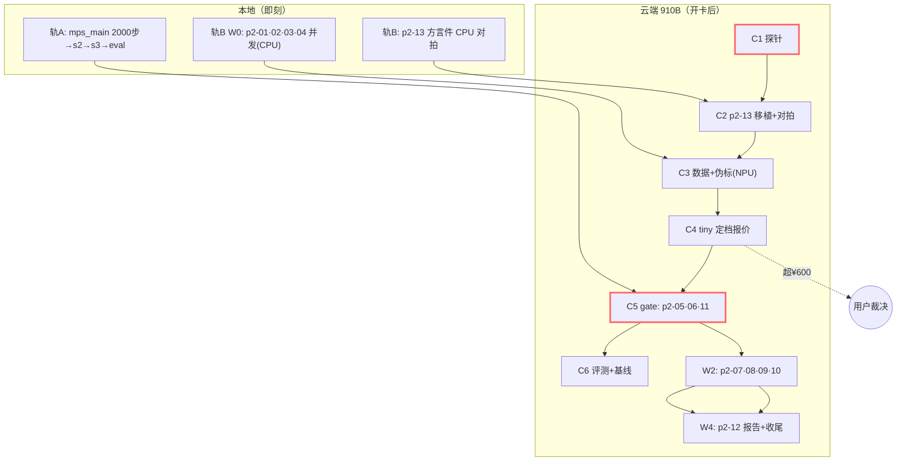

# Tasks · teacher-p2-production-full（一级只编排）

> 只编排：本件只列子变更清单与收尾；孙任务在各二级 `tasks.md`。
> 启动门：轨 A（P1 收官）与轨 B（W0 开发）无前置即可发；**云端 C5 gate 须待轨 A 完成 + C4 报价获批（¥600 熔断线）**。
> 波次语义：轨/段仅为汇报分组，解锁=依赖产物入 main。

> **资源等待表（R18 制度，随释放事件消费）**：
> | 资源 | 当前持有 | 释放后等待面 | 状态 |
> |---|---|---|---|
> | MPS | 空闲 | p2-07 A2 设备边界取证 ✓ · p2-01 swap_brain MPS 补验 ✓ · p2-08 B1 加/去图（待 C5 产物） | 已消费两轮；余一项挂 C5 |
> | CPU | 编排者 v4 曲线长跑中 | laya G3 全量 100 题出分（不依赖 SFT，可先跑——p2-09 B2 的基线半列） | 待跑（下动作） |
> | 910B | 未开卡 | C1 探针两命令 · GDN 方言件首编 | 待卡 |
> | GLM API | 空闲(配额内) | 已产 10 行视觉 pack；3–6k 全量产标待 C3 | 按计划 |

## 本地轨 A（P1 收官，scratch 侧）

- [ ] A1 mps_main 2000 步正式档 → s2 决策 SFT → s3 校准 → eval 全套（每步 run-id 入 scratch/runs；完成评审勾选）
- [ ] A2 轨 A 回顾点：eval 异常纠偏记录（apply-orchestration 四查）

## 本地轨 B（P2 开发，CPU 为主）

- [ ] p2-01 backbone-assets〔四查：空返但半成品在产，重派复跑验证+补完中〕 — 载重接缝 — `changes/p2-01-backbone-assets/`（三校验+**HF→自研栈张量布局转换**）
- [x] p2-02 teacher-adapters — 教师适配 — `changes/p2-02-teacher-adapters/`（**三教师分工【D9 终态】**：StartLux-4B 文本主径 + GLM-5.3-Flash API 视觉伪标 + Qwen3.5-4B 备选；**D11 版权边界**；B3 三路真实路径验证）
- [x] p2-03 eval-registry — 评测注册 — `changes/p2-03-eval-registry/`（pin+锚点+parity 裁定；harness 预留 NPU 推理口）
- [x] p2-04 baselines-dual — 双基线 — `changes/p2-04-baselines-dual/`（laya 本地 + StartLux-0.8B **对照评测（D11 白名单③）**）
- [x] W1（B 轨）：p2-05 训练代码开发 + CPU 冒烟 —— 本地半场 5/7（kernel×torch 双曲线 100 步逐点对拍 2.6e-05、伪标缓存 512 题、7 档 run 含 2 中止负结果；B3b/C1 待 C5）
- [x] p2-13 本地半场：七类算子方言件 target=cpu 语义对拍（linear/rope/attn/GDN/LN/读出 + LoRA 注入件）—— **20 绿，GDN 反向 partial 在册（spec 例外条）；R3–R7 待开卡**

## 云端轨 C（910B，开卡后分段短租）

- [ ] C1（p2-13 首孙任务）环境与方言探针：CANN/torch_npu/tilelang 910B dialect/TileKernels(950 标注)兼容性 + 吞吐初值 —— 产出：run notes 探针结论 + **底座决策**（全自研 or torch_npu 回退）
- [ ] C2 p2-13 云端半场：算子移植+梯度对拍（fp32 参考互锁）+ 自研栈 vs torch_npu 基准表
- [ ] C3 数据上云 + 教师伪标生产（StartLux-4B 打分跑 NPU；GLM API 视觉伪标本地/任意端产包上云）
- [ ] C4 tiny 冒烟全链（SFT→OPD→RL 各 tiny）+ 吞吐定档 + **gate 成本报价**（超 ¥600 熔断上报）
- [ ] p2-05 prod-sft — gate 正式档 on 910B（【P1 教训】配置存在≠实跑）
- [ ] p2-06 prod-opd — gate 正式档（教师同卡打分内存账，64GB 显存）
- [ ] p2-11 prod-rl — gate 正式档（RLCD+双通道 verifier）

## 扩展与收尾（C5 后）

- [ ] p2-07 long-context — 原生 262K；1M=9B 扩展点；0.8B@1M 边界实验=三件套【滑窗封顶+GDN 适配器+门控，D7】
- [ ] p2-08 multimodal-tower — 自带塔启用 + processor + 加/去图对照【G5 同基座对照，D10】
- [ ] p2-09 chinese-track — 决策化+配比消融+laya 崩溃列
- [ ] p2-10 serving — 跨后端（**含 NPU 后端**）+ prefix_cache 联动
- [ ] p2-12 tech-report — 受控实验报告 + **成本报表（D12）** + 复现指南
- [ ] F1 契约零改动断言（`decision/` diff 空）
- [ ] F2 全量门禁（scratch 与 release 双侧 CI exit 0）
- [ ] F3 DoD 逐项核验入收尾 run（含 D11 版权自查：产出物零 StartLux 权量）
- [ ] F4 openspec archive + 导览（run-id 逐字符核对）
